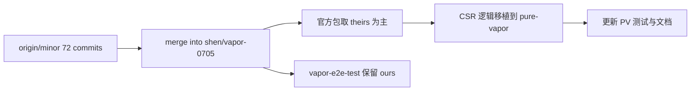

# 同步 origin/minor → shen/vapor-0705 → pure-vapor

## 现状结论

- 当前分支：`shen/vapor-0705`（tip `2963121fc`）
- 目标：`origin/minor`（tip `3c9499c35`，`v3.6.0-rc.2`）
- 落后：**72** 个 commit（含 release / chore / main→minor merge）；其中 vapor 路径相关约 **22** 个实质 fix/feat
- 上一轮 [pure-vapor 官方同步](.cursor/plans/pure-vapor_官方同步_0901f075.plan.md) 已完成；本轮是**下一批** upstream 追平
- 同步规范仍以 [`packages/pure-vapor/UPSTREAM-SYNC.md`](packages/pure-vapor/UPSTREAM-SYNC.md) 为准：**跳过** hydration / SSR / vdomInterop / Suspense

## vapor-e2e-test 判断（先答你的问题）

**本轮 `origin/minor` 没有增加任何新的 e2e 示例。**

`git log HEAD..origin/minor -- packages-private/vapor-e2e-test` 为空；三点 diff 无文件变更。

反而当前分支比 minor **更丰富**：

| 仅存在于当前分支 | 说明 |
|------------------|------|
| `helloworld/` | pure-vapor 开发冒烟 |
| `blocks/` | Block 探测 |
| `lifecycle/` | 生命周期手动验证 |
| `__remove-test/interop/*.vue` | 原 interop 用例被移到此处 |

minor 上仍有 `transition/cases/interop/` 下 4 个同内容文件；当前分支已迁到 `__remove-test/interop/`（R100）。

**合并默认策略**：保留当前分支本地 e2e 扩展（helloworld / blocks / lifecycle / `__remove-test`），不以 minor 覆盖删掉它们。



---

## 阶段 A：合入官方 minor

1. 在干净工作区执行：`git merge origin/minor`（允许有冲突）
2. 冲突处理原则：
   - **官方包**（`compiler-*` / `runtime-*` / `reactivity` / `shared` / `vue` 等）：优先取 `origin/minor`（theirs），必要时重跑对应测试确认
   - **`packages/pure-vapor/**`**：保留 ours，留待阶段 B 手工移植
   - **`packages-private/vapor-e2e-test/**`**：保留 ours（本地 helloworld/blocks/lifecycle + `__remove-test`）
3. 合入后先验证官方栈：
   - `vp run build runtime-vapor compiler-vapor`
   - `vp run test runtime-vapor`（或至少 CSR 相关 spec）
   - 按需 `vp run test compiler-vapor -t 'vOn|logicalIndex|Transition'`

---

## 阶段 B：pure-vapor CSR 逻辑同步（按优先级）

对每个文件：`runtime-vapor` diff → 移植到 `pure-vapor` → **删除** hydration/interop/Suspense 分支 → 跑 PV 测试。

### B0 — 必做（BREAKING / 编译契约）

| Upstream | 影响 PV | 动作 |
|----------|---------|------|
| **#15127** 事件委托改为 opt-in | compiler 生成默认 `on` 而非 `delegate`；移除 `eventDelegation` 选项；`.delegate` modifier | 刷新 [`compileSmoke`](packages/pure-vapor/__tests__/compileSmoke.spec.js) 快照；检查 PV 文档/README；若有手写 `delegateEvents` 假设的测试则改写；[`event.js`](packages/pure-vapor/src/vapor/dom/event.js) API 本身通常无需大改 |
| **#15065** omit default prepend logical index | 生成代码更精简 | 同上，更新 compileSmoke |
| **#15124** helper/cache 变量名碰撞 | 仅 compiler | 无 PV 源码改动；快照可能变 |

### B1 — 运行时 CSR 行为

| Upstream | 目标文件 | 要点 |
|----------|----------|------|
| **#15069** Transition root 上 v-if + v-show | [`Transition.js`](packages/pure-vapor/src/vapor/components/Transition.js) | 移植 Transition 分支；对应测试 |
| **#15125** TransitionGroup 体积重构 | `Transition.js` / `TransitionGroup.js` / 可能 `fragment.js` / `transition` 辅助 | 大块 refactor；只搬 CSR 路径，跳过 `vdomInterop` 段 |
| **#15149** functional component root bindings | [`component.js`](packages/pure-vapor/src/vapor/component.js) + [`dom/prop.js`](packages/pure-vapor/src/vapor/dom/prop.js) | 保留函数式组件根绑定 |
| **#15130** prod 下 contain setup errors | `component.js` | 错误边界与 prod 行为对齐 |
| **#15141** `setCurrentInstance` 后恢复 undefined effect scope | `component.js` / `componentProps.js` / Teleport / Transition / [`internal/instance.js`](packages/pure-vapor/src/internal/instance.js) | 对照 runtime-core 的 currentInstance 变更一并移植到 internal |
| **#15095** revert function ref pause tracking | [`apiTemplateRef.js`](packages/pure-vapor/src/vapor/apiTemplateRef.js) | 与官方一致回退 |

### B2 — 明确跳过（不移植到 pure-vapor）

- hydration 系列：#15150 / #15147 / #15145 / #15132 / #15131
- Suspense：#15144 / #15139 / #15133
- vdomInterop：#15140 / #15111 / #15089 / #15074 等

若这些提交改动了共享 CSR 分支（例如 `component.ts` 里 async setup context #15129），只抽取 **非 hydration/interop** 的 else 路径。

---

## 阶段 C：测试与文档

1. **测试移植 / 更新**（跳过 interop/hydration describe）：
   - Transition：#15069 新增用例 → [`Transition.spec.js`](packages/pure-vapor/__tests__/components/Transition.spec.js)
   - TransitionGroup：#15125 新增用例 → `TransitionGroup.spec.js`
   - componentAttrs / functional root：#15149 → 现有 `componentProps` 或新增 attrs 子集
   - errorHandling：#15130 → 若 PV 无对应文件则新增精简 CSR 用例
   - event / compileSmoke：对齐 #15127 默认直接绑定
2. **文档**：
   - 更新 [`UPSTREAM-SYNC.md`](packages/pure-vapor/UPSTREAM-SYNC.md)「最后同步说明」列，记录同步到 `origin/minor` tip（含 rc.2 / #15127 BREAKING）
   - 更新 [`README.md`](packages/pure-vapor/README.md)：事件默认不再委托、`.delegate` 用法；版本说明可对齐 `3.6.0-rc.2` 语义（是否改 `package.json` version 按你仓库惯例）
3. **验收命令**：
   ```bash
   vp run build pure-vapor
   vp run test pure-vapor
   ```
   可选：`vp run test-e2e-vapor`（确认本地 e2e 扩展未因 merge 丢失）

---

## 风险与注意

- merge 冲突面大（compiler/runtime 大量 “changed in both”）；官方包倾向 theirs，避免手工半合并
- #15125 Transition/TransitionGroup 重构与当前 PV Transition 实现可能冲突大，建议以 minor 的 RV 文件为基准重 diff，而不是 cherry-pick 单 commit
- #15127 是 **BREAKING**：任何依赖「默认委托」的 PV 示例/测试必须改
- e2e **无需**从 minor 拉新用例；合并时切勿用 minor 目录覆盖掉本地 helloworld/blocks/lifecycle
