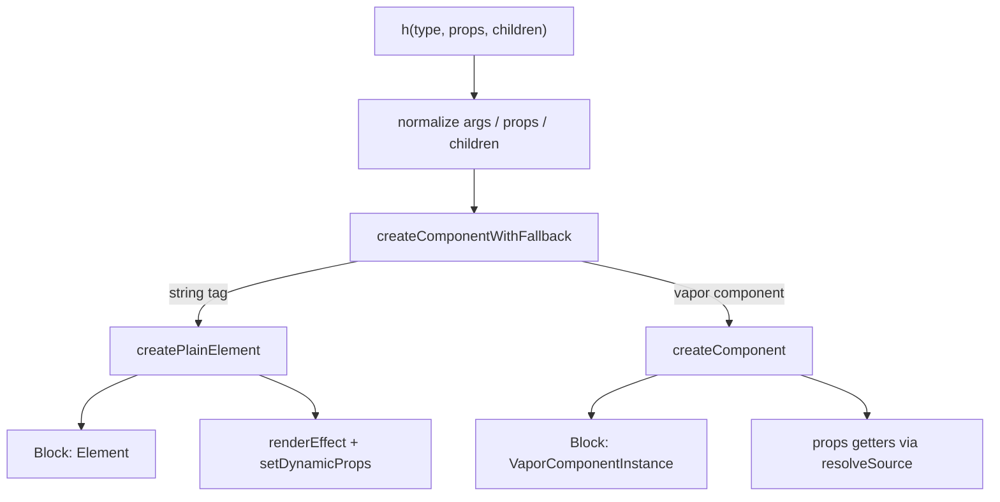

# pure-vapor 原生 `h()` 实现方案

## 结论

**可以做，而且应做成 Vapor-native `h`，而不是移植 VDOM。**

- 返回值是 **Block**（DOM / 组件实例 / Fragment），不是 `VNode`
- 响应式走现有 [`createPlainElement`](packages/pure-vapor/src/vapor/component.js) / [`createComponent`](packages/pure-vapor/src/vapor/component.js) 路径（`renderEffect` + `resolveDynamicProps`）
- **不能**让官方 vue-router 开箱即用（它依赖 VNode patch）；本方案目标是手写程序化渲染



## 设计决策（已选定）

| 项 | 选择 |
|----|------|
| 返回类型 | Block（与其它 vapor helper 一致） |
| 底层实现 | 复用 `createComponentWithFallback` |
| 响应式模型 | **getter / ref 驱动**（对齐编译器产物），不是整树重跑 render |
| Fragment | 支持：`h(Fragment, ...)` 返回 `Block[]` |
| VDOM 组件 | 不支持；DEV 下对非 vapor 组件告警 |
| 导出名 | 公开导出 `h`；从 `EXCLUDED_EXPORTS` 移除 |

**响应式用法（与编译器一致）：**

```js
const msg = ref('hi')
// props / children 用 getter 或 ref，才能随数据更新
h('div', { class: () => msg.value }, () => msg.value)
h(Comp, { foo: () => msg.value }, { default: () => h('span', null, () => msg.value) })
```

普通快照值（`h('div', { class: msg.value })`）只渲染一次——这与直接调用 `createPlainElement('div', { class: 'hi' })` 行为一致。

## 实现要点

### 1. 新增 [`packages/pure-vapor/src/vapor/h.js`](packages/pure-vapor/src/vapor/h.js)

对齐 [`runtime-core/src/h.ts`](packages/runtime-core/src/h.ts) 的参数重载解析：

1. `h(type)`
2. `h(type, props)`
3. `h(type, children)`（第二参为 array / string / number / block / function 时视为 children）
4. `h(type, props, children)`

核心转换：

- **props → rawProps**
  - 普通值：原样放入 rawProps（静态）
  - `ref`：转为 `() => unref(val)`（利用 [`resolveSource`](packages/pure-vapor/src/vapor/componentProps.js) 已有函数 getter 语义）
  - 已是 function：保留为 getter
  - `onXxx` 事件：保持函数引用（不要包成会反复创建的 getter，除非本身是 ref）
- **children → rawSlots**
  - `string | number`：`{ default: () => createTextNode(String(c)) }`
  - `ref`：动态 default slot（带 `$`），slot 内读 `unref` 并创建/更新文本
  - `() => ...`：作为 default slot；若返回 string/number 则再规范成 text node
  - `Block` / `Block[]`：`{ default: () => children }`
  - 具名插槽对象：`{ header: fn, default: fn }` 直接作为 rawSlots
- **type**
  - `string` / vapor 组件 → `createComponentWithFallback(type, rawProps, rawSlots, true)`
  - `Fragment`（本包内定义的符号）→ 规范化 children 为 `Block[]` 并返回
  - 动态 type（ref/getter）→ 走 `createDynamicComponent`

`Fragment`：在 `h.js` 内导出轻量符号（如 `export const Fragment = Symbol('Fragment')`），**不是** VDOM Fragment。

### 2. 导出与契约

- [`packages/pure-vapor/src/index.js`](packages/pure-vapor/src/index.js)：`export { h, Fragment } from './vapor/h.js'`
- [`packages/pure-vapor/__tests__/exports.spec.js`](packages/pure-vapor/__tests__/exports.spec.js)：`h`（及 `Fragment`）移入 `REQUIRED_EXPORTS`，移出 `EXCLUDED_EXPORTS`
- [`packages/pure-vapor/README.md`](packages/pure-vapor/README.md)：更新「不导出 h」表述，说明这是 **Block 版 h**，不能替代 VDOM `h` / vue-router

### 3. 测试（[`packages/pure-vapor/__tests__/h.spec.js`](packages/pure-vapor/__tests__/h.spec.js)）

覆盖：

- 标签：`h('div')`、`h('div', { id: 'x' })`、嵌套 children
- 组件：`h(defineVaporComponent(...), props, slots)`
- 响应式 props：`{ class: () => cls.value }` / ref 包装后 `nextTick` 更新 DOM
- 响应式文本 children：getter / ref
- 具名插槽对象
- `h(Fragment, null, [a, b])` 多根
- 参数重载：`h('div', 'text')`、`h('div', [child])`、`h(Comp, () => child)`
- DEV：传入非 vapor 的 options 组件时告警（可选，有现成 warn 工具则加）

测试风格贴近现有 [`componentSlots.spec.js`](packages/pure-vapor/__tests__/componentSlots.spec.js) / `createComponent` 用法（`define(...).render()`）。

### 4. 明确不做

- 不移植 `vdomInterop` / 不引入 `@vue/runtime-dom`
- 不返回 `VNode`，不实现 `createVNode` / `openBlock` / patchFlags
- 不宣称兼容官方 vue-router 的 `RouterView`（仍需 Vapor 原生路由出口）
- 不改 jsx-runtime（仍可后续再接；本次只做运行时 `h`）

## 验证

```bash
vp run test pure-vapor -t "h"
vp run test pure-vapor -t "public exports"
```

## 关键文件

- 新建：`packages/pure-vapor/src/vapor/h.js`
- 复用：`component.js`（`createComponentWithFallback` / `createPlainElement`）、`componentProps.js`（`resolveSource`）、`apiCreateDynamicComponent.js`
- 契约：`src/index.js`、`__tests__/exports.spec.js`、`README.md`
