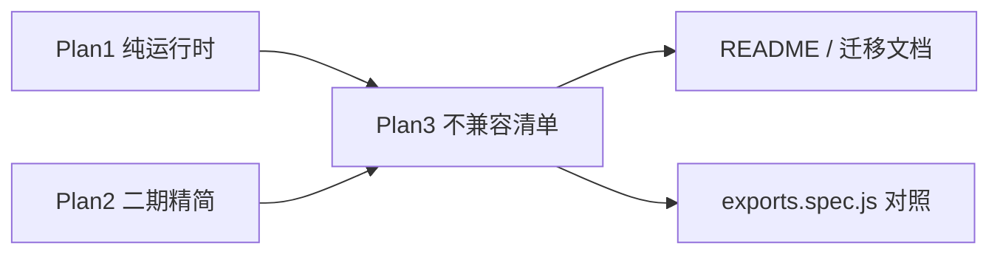

# pure-vapor 不兼容清单（第 3 份 Plan）

## 目标

新增 [`./pure-vapor_不兼容清单_<id>.plan.md`](./)，与已有两份 plan 形成三角关系：

| Plan | 角色 |
|------|------|
| [pure-vapor_纯运行时_8015eb3b.plan.md](./pure-vapor_纯运行时_8015eb3b.plan.md) | **做什么**：初版架构、导出契约、DOM 队列、实现阶段 |
| [pure-vapor_二期精简_bdd218a4.plan.md](/pure-vapor_二期精简_bdd218a4.plan.md) | **怎么演进**：内联 App、多 App 隔离、去 legacy、注释 |
| **本文件（新建）** | **不是什么**：对外不兼容点、行为差异、迁移注意、编译器陷阱 |



- **无 implementation todos**（`isProject: false`，todos 为空或仅 `sync-readme` 可选）
- 两份旧 plan 文首增加一行交叉链接指向本文件

---

## 建议文件名与 frontmatter

```yaml
---
name: pure-vapor 不兼容清单
overview: 登记 pure-vapor 相对 vue（index-with-vapor）、runtime-vapor、VDOM 应用的不导出项、行为差异与编译器陷阱；供迁移与评审查阅，非实现计划。
todos: []
isProject: false
---
```

---

## 文档结构（正文大纲）

### 1. 适用范围与兼容前提

**兼容**（明确写清，避免误读为「什么都跑不了」）：

- [`compiler-vapor`](packages/compiler-vapor) 在 `runtimeModuleName: 'pure-vapor'` 下生成的 **Vapor 模板 helper**（`insert`、`renderEffect`、`createIf` 等）
- **Composition API + `<script setup>`**（`defineProps` / `defineEmits` / …）
- **Vapor 内置**：`VaporTeleport`、`VaporKeepAlive`；指令 `applyVShow`、`apply*Model`、`withVaporDirectives`
- **客户端 CE**：`defineVaporCustomElement`（无 SSR CE）
- **再导出**：完整 `@vue/reactivity` + `shared` 子集（见 [index.js](packages/pure-vapor/src/index.js)）

**不兼容**（本文件主体）：

- 传统 **VNode / `h()` / `openBlock`** 渲染路径
- **`vue` 全量包**中 VDOM、SSR、devtools、interop、Suspense、Transition 等（见下表）
- 将 **Options API 对象组件**、**mixins**、**VDOM 子组件** 混入 Vapor 树而不做隔离

### 2. 相对 `vue`（index-with-vapor）— API 不导出

从 [Plan1 剔除表](./pure-vapor_纯运行时_8015eb3b.plan.md) 与 [`exports.spec.js`](packages/pure-vapor/__tests__/exports.spec.js) 合并为**主表**（分类 | 不导出符号 | 若误用会怎样 | 替代/规避）：

| 分类 | 代表符号 | 后果 | 替代 |
|------|----------|------|------|
| 运行时编译 | `compile` | import 失败 | 构建期 `compiler-vapor` / `compiler-sfc` |
| VDOM 渲染 | `h`, `createVNode`, `openBlock`, `Fragment`, … | import 失败 | Vapor 模板 + compiler helpers |
| VDOM App | `render`, `hydrate` | import 失败 | `createVaporApp` + `mount` |
| SSR | `createSSRApp`, `createVaporSSRApp`, `useSSRContext`, `onServerPrefetch`, `hydrateOn*`, … | 无服务端渲染/注水 | 仅 CSR；勿配 SSR 构建 |
| VDOM 内置 | `Teleport`, `KeepAlive`, `Suspense`, `Transition`, `TransitionGroup` | import 失败 | `VaporTeleport`, `VaporKeepAlive`；勿用 Suspense/Transition |
| Vapor 未实现 | `VaporTransition`, `VaporTransitionGroup`, `vaporInteropPlugin` | import 失败 | 避免 `<transition>`；勿混 VDOM |
| VDOM 指令/CE | `withDirectives`, `vModelText`, `defineCustomElement`, `VueElement`, … | import 失败 | `apply*Model`, `defineVaporCustomElement` |
| Options API / mixins | `app.mixin()`, Options 字段运行时 | 无合并/无 options 运行时 | 仅 `<script setup>` |
| Devtools / compat | `devtools`, `setDevtoolsHook`, `compatUtils`, `vdomInterop*` | 无调试/互操作 | 不依赖 Vue Devtools Vapor 面板 |
| Feature flags | `initFeatureFlags`（已移除 [featureFlags.js](packages/pure-vapor/src/internal/featureFlags.js)） | 无需注入 `__VUE_PROD_DEVTOOLS__` 等 | 构建仅保留 `__DEV__` |
| 其它 | `registerRuntimeCompiler`, `createRenderer`, `@internal` 泄漏符号 | 非公开面 | — |

**迁移别名**（有导出但语义不同，单独小节，避免与「不导出」混淆）：

| 别名 | 实际指向 | 注意 |
|------|----------|------|
| `createApp` | `createVaporApp` | 非 VDOM `createApp` |
| `defineComponent` | `defineVaporComponent` | 非 Options 组件工厂 |
| `defineAsyncComponent` | `defineVaporAsyncComponent` | — |
| `useCssVars` | `useVaporCssVars` | — |

未列入别名表的 VDOM 名称（如 `useShadowRoot`）**不提供**。

### 3. 相对 `@vue/runtime-vapor` — 行为差异（仍「兼容编译产物」）

| 项 | runtime-vapor | pure-vapor | 迁移影响 |
|----|---------------|------------|----------|
| 依赖 | `runtime-dom` → `runtime-core` | 仅 `shared` + `reactivity` + `internal/` | 包更小；行为以 pure-vapor 为准 |
| DOM 写入 | 同步直接操作 DOM | 同步直接操作 DOM（与 runtime-vapor 一致；`domOps` 为薄封装） | 与官方 vapor 对齐 |
| `nextTick` | 无公开导出（upstream） | **公开**；与 runtime-core scheduler 一致（microtask flush 之后） | 与 Vue 3 CSR 的 `nextTick` 语义一致 |
| TypeScript | 有 `.d.ts` | **无** `types` | 自建 `declare module 'pure-vapor'` 或 JSDoc |
| 构建格式 | esm-bundler | 同 | 非 Node SSR 运行时 |

引用 Plan1：[DOM 与调度](./pure-vapor_纯运行时_8015eb3b.plan.md)（已与 runtime-vapor 对齐，无批量 DOM 队列）。

### 4. 编译器仍可生成、运行时无符号（陷阱）

| 模板/编译行为 | 运行时现状 | 建议 |
|---------------|------------|------|
| `<Suspense>` | `compiler-vapor` 可能生成 import；**不导出** `Suspense` | 应用层禁止；Plan1 不改 compiler |
| `<transition>` / `<Transition>` | 可能生成 `VaporTransition` import；**不导出** | 用 CSS/JS 动画，勿依赖 enter/leave 运行时 |
| hydration helper import | [`hydration.js`](packages/pure-vapor/src/vapor/dom/hydration.js) **no-op stub** | 满足 import；无真实注水 |
| `withHydration` 调用链 | no-op / 已删业务分支（Plan2 `strip-legacy`） | 勿依赖 SSR 注水语义 |

### 5. 组件模型与 App 能力限制

| 能力 | 状态 |
|------|------|
| Options API（`data`/`methods`/options `watch`） | 不支持 |
| `app.config.globalProperties` | 不支持（`config` 无该字段；Vapor 无 `this`/实例代理挂载全局属性） | 使用 `app.provide(key, value)` + `inject()` |
| `app.config.compilerOptions` | 无运行时效果（不导出 `compile`；源码不读取 `appContext.config.compilerOptions`，赋值不生效） | 在**构建期**通过 `compiler-vapor` / `compiler-sfc` 配置（如 `isCustomElement`、`runtimeModuleName: 'pure-vapor'`） |
| `app.mixin()`、app 级 `mixins` / `optionMergeStrategies` | 不支持 |
| `defineOptions` | **编译期宏** stub，非 Options 运行时 |
| VDOM 组件作为 Vapor 子树 | 无 `vaporInteropPlugin` |
| HMR 专用模块 | 未移植（Plan1 可选二期） |
| Devtools hook | 无；源码或仍有 `devtoolsRawSetupState` 等 DEV 字段，无对外 devtools API |

### 6. 源码残留 vs 对外承诺（Plan2 清理中）

登记「**内部仍有痕迹、对外视为不支持**」，避免 Review 误判为已支持：

| 残留 | 文件 | Plan2 动作 | 对外语义 |
|------|------|------------|----------|
| `isInSSRComponentSetup` / `setInSSRSetupState` | `instance.js`, `lifecycle.js`, `apiSetupHelpers.js` | `strip-legacy` 删除 | 无 SSR setup |
| `setupContext` 分支 | `apiSetupHelpers.js` | 去掉，实例即上下文 | — |
| `getInheritedScopeIds` 恒 `[]` | `scopeId.js` | 删死代码 | — |
| `hydration.js` | `vapor/dom/` | 保留 no-op import | 无 hydration |
| 模块级单例 scheduler（多 App 串扰） | `scheduler.js` | Plan2 `_Internal` 分桶 | 文档注明：**当前**多 App 同页需谨慎；二期后改为「按 app 隔离」 |

### 7. 构建与工具链

| 项 | pure-vapor |
|----|------------|
| `runtimeModuleName` | 须在 `compiler-vapor` / SFC 显式设为 `'pure-vapor'`（不改 monorepo 默认） |
| Vite `alias: { vue: 'pure-vapor' }` | 须与编译选项一致，否则 helper import 与运行时不匹配 |
| Feature flags | 不实现 devtools / hydration mismatch 生产开关 |
| 修改 `compiler-vapor` / `runtime-vapor` / `vue` 包 | **不在** pure-vapor 计划范围内 |

### 8. 与 Plan2 的边界（避免重复为「不兼容」）

以下内容属于 **实现改进**，写入 Plan3 仅作「当前限制 → 二期修复」对照，**不**算作对 compiler 的长期不兼容：

- 多 App 共享模块级 scheduler/DOM 队列 → Plan2 `app._Internal` 分桶
- `createAppAPI` 注入工厂 → Plan2 内联 `createVaporApp`

### 9. 维护约定

- **单一事实来源**：API 不导出以 Plan1 剔除表 + `exports.spec.js` 的 `EXCLUDED_EXPORTS` 为准；行为差异以 Plan1 DOM 队列节 + README 为准
- 新增不兼容项：先更新 Plan3，再同步 [`README.md`](packages/pure-vapor/README.md)「首版不支持」表（可选 `sync-readme` todo）
- Plan1 / Plan2 文首增加：`详见 [pure-vapor 不兼容清单](./pure-vapor_不兼容清单_<id>.plan.md)`

---

## 实施步骤（用户确认后执行）

1. 在 `./` 创建 `pure-vapor_不兼容清单_<id>.plan.md`，按上文 9 节写入完整表格与交叉链接
2. 在 [pure-vapor_纯运行时_8015eb3b.plan.md](./pure-vapor_纯运行时_8015eb3b.plan.md)「目标与约束」或文首增加指向 Plan3 的链接
3. 在 [pure-vapor_二期精简_bdd218a4.plan.md](./pure-vapor_二期精简_bdd218a4.plan.md)「不在本计划范围」旁增加 Plan3 链接；修正 2.4 节仍写 `featureFlags.js` 的过时表述（改为「已移除，见 Plan3」）
4. （可选）将 README「首版不支持」改为「详见 Plan3」并保留简短摘要

---

## 不纳入 Plan3 的内容

- 具体实现步骤、todos、PR 拆分（留在 Plan1/2）
- 测试用例编写细节（Plan1 `tests-docs`）
- 性能 benchmark 与 bundle size 数字（除非作为不兼容的**后果**简述）
