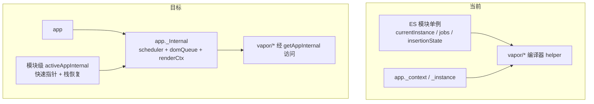
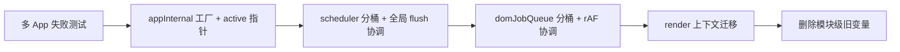

# pure-vapor 二期：精简、多 App 隔离与可维护性

## 背景与起点

[初版计划](.\pure-vapor_纯运行时_8015eb3b.plan.md) 中脚手架～内置组件已完成；`tests-docs` 仍为 pending，建议在二期一开始补上 **多 App 基线测试**，作为 `_Internal` 改动的安全网。

当前架构要点（保持不变）：

- 仅 Vapor 运行时 + `internal/` 替代 runtime-core/dom
- DOM 写操作经 [`domJobQueue.js`](e:\core\packages\pure-vapor\src\internal\domJobQueue.js) + rAF
- App 已有 `_context` / `_instance`，但 **无** `app._Internal`；大量状态在模块顶层



---

## 目标 1：Vapor-only 路径精简

**动机**：`createAppAPI(mount, unmount, getPublicInstance)` 是为 runtime-dom / runtime-vapor 共用而设计的注入工厂；pure-vapor 只有 [`mountApp`](e:\core\packages\pure-vapor\src\vapor\apiCreateApp.js) 一条挂载路径，可合并为单一实现。

### 1.1 合并 App 创建（高优先级）

| 现状 | 目标 |
|------|------|
| [`apiCreateApp.js`](e:\core\packages\pure-vapor\src\vapor\apiCreateApp.js) 懒初始化 `_createApp = createAppAPI(...)` | 删除 `_createApp`；在 `createVaporApp` 内直接构造 app 对象 |
| [`app.js`](e:\core\packages\pure-vapor\src\internal\app.js) `createAppAPI` 闭包 + `mount(_, isHydrate, namespace)` | `mount(container)` 仅接收容器；`mountApp` 不再透传未使用参数 |
| `postPrepareApp` 再次设置 `app.vapor = true` 并包装 `mount` | 合并进一次 `createVaporApp`：`normalizeContainer` + `runWithDomOps` 在唯一 `mount` 实现里完成 |
| `app.vapor` / `instance.vapor` 恒为 true | 保留一处即可（建议仅 `app.vapor` 作公开标记，实例侧可删 DEV 分支） |

**保留**：`createAppContext()`、`validateComponentName`、`normalizeContainer`、`plugin`/`provide`/`component`/`directive` 等与 upstream 对齐的 App 表面行为。

**可选（exports 阶段再定）**：[`src/index.js`](e:\core\packages\pure-vapor\src\index.js) 的 `createApp` → `createVaporApp` 别名是否保留。

### 1.2 删除/收窄 VDOM·SSR 残留（中优先级）

按文件分批，每批跑 `vp run test pure-vapor`：

| 区域 | 文件 | 动作 |
|------|------|------|
| SSR setup | [`instance.js`](e:\core\packages\pure-vapor\src\internal\instance.js)、[`apiSetupHelpers.js`](e:\core\packages\pure-vapor\src\vapor\apiSetupHelpers.js)、[`lifecycle.js`](e:\core\packages\pure-vapor\src\internal\lifecycle.js) | 移除 `isInSSRComponentSetup` / `setInSSRSetupState` 及相关分支 |
| setupContext | `apiSetupHelpers.js` `getContext` | Vapor 实例即 setup 上下文，去掉 `i.setupContext` 分支 |
| scope 继承 | [`scopeId.js`](e:\core\packages\pure-vapor\src\internal\scopeId.js) | 删除恒返回 `[]` 的 `getInheritedScopeIds`（若无引用） |
| 渲染上下文 | [`componentRenderContext.js`](e:\core\packages\pure-vapor\src\internal\componentRenderContext.js) | 审计 `currentScopeId`（当前可能只写不读），删死代码或并入 `_Internal` |
| Hydration stub | [`dom/hydration.js`](e:\core\packages\pure-vapor\src\vapor\dom\hydration.js) | 保留编译产物 import 的 no-op，不在业务路径分支 |

### 1.3 验收

- `vp run build pure-vapor` / `vp run test pure-vapor`
- 现有 `__tests__` 与 exports 契约 [`exports.spec.js`](e:\core\packages\pure-vapor\__tests__\exports.spec.js) 仍通过

---

## 目标 2：`app._Internal` 与多 App 完全隔离

**你已确认**：scheduler（`jobs` / `postJobs`）与 domJobQueue（`jobDomOperatorList` / `nextTickCbs`）**按 app 分桶**。

### 2.1 新增模块与数据结构

新增 [`src/internal/appInternal.js`](e:\core\packages\pure-vapor\src\internal\appInternal.js)（名称可微调，对外不导出）：

```js
// 示意 — 实现期用工厂函数 createAppInternal(app)
{
  app, // 回指
  // --- scheduler 桶 ---
  scheduler: {
    jobs, postJobs, activePostJobs,
    jobsLength, flushIndex, postFlushIndex,
    isFlushing, currentFlushPromise,
  },
  // --- DOM 队列桶 ---
  dom: {
    jobDomOperatorList,
    nextTickCbs,
    flushScheduled, rafId, // 或仅 flushScheduled，见下
  },
  // --- 渲染执行上下文（与编译 helper 同步使用）---
  render: {
    currentInstance,       // 或 instance 栈数组 + 栈顶
    insertionParent, insertionAnchor, insertionIndex,
    inOnceSlot, currentSlotOwner,
    currentSlotBoundary,
    currentRenderingInstance,
    // KeepAlive / Teleport 若需按 app：currentKeepAliveCtx, currentCacheKey
  },
}
```

在 [`createAppAPI` 合并后的工厂](e:\core\packages\pure-vapor\src\internal\app.js) 中：`app._Internal = createAppInternal(app)`（与 `_uid` 同时创建）。

**模块级快速指针**（性能与编译 helper 兼容）：

```js
let activeAppInternal = null
export function setActiveAppInternal(internal) { /* save/restore 栈 */ }
export function getActiveAppInternal() { return activeAppInternal }
```

- `app.runWithContext`、`mount`/`unmount`、`renderEffect.run`、`callWithErrorHandling` 入口：与 `setCurrentInstance` 同样 **try/finally** 切换 `activeAppInternal`
- 公开 API `getCurrentInstance()` 改为读取 `activeAppInternal.render.currentInstance`（或保留薄包装）

### 2.2 Scheduler 按 app 分桶

重构 [`scheduler.js`](e:\core\packages\pure-vapor\src\internal\scheduler.js)：

- 顶层 `jobs` 等 **全部迁入** `internal.scheduler`
- `queueJob(job, id, isPre)` 解析目标桶：
  1. `job.i`（RenderEffect / 组件 job）→ `job.i.appContext.app._Internal`
  2. `watch` 等在 setup 内创建 → 创建时捕获 `getActiveAppInternal()` 并挂在 job/`Watcher` 上
  3. 无 app 关联（极少数）→ `__DEV__` warn；测试可用显式 `flushApp(app)` 
- `flushJobs(internal)` / `flushOnAppMount(app)` 只刷 **该 app** 的队列
- **全局 microtask 协调器**（推荐，避免 N 个 app N 个 Promise 链）：
  - 模块级 `pendingApps: Set<AppInternal>` + 单一 `currentFlushPromise`
  - 一次 microtask 内 **按注册顺序** 依次 `flushJobs(internal)`，每个 internal 末尾 `scheduleDomFlush(internal)`

### 2.3 DOM 队列按 app 分桶

重构 [`domJobQueue.js`](e:\core\packages\pure-vapor\src\internal\domJobQueue.js)：

- `queueDomOp(type, payload)` → 写入 `getActiveAppInternal().dom.jobDomOperatorList`（`domOps` 门面不变）
- `nextTick(fn)` → 回调进入 **当前 active app** 的 `nextTickCbs`；`scheduleDomFlush(internal)` 只标记该 app
- **全局 rAF 协调器**（与 scheduler 对称）：
  - `pendingDomApps: Set` + 单个 `requestAnimationFrame`
  - 一帧内顺序 `flushDomJobs(internal)`，再 `flushNextTickCbs(internal)`
- `runWithDomOps(fn)`：在 `setActiveAppInternal` 作用域内执行，结束 `scheduleDomFlush` 针对该 app
- 测试辅助：`flushDomJobs(app)` / `flushAllApps()` 替代全局 `flushDomJobs()`

### 2.4 渲染上下文迁入 `_Internal.render`

| 现模块级变量 | 迁移目标 |
|-------------|----------|
| [`instance.js`](e:\core\packages\pure-vapor\src\internal\instance.js) `currentInstance` | `_Internal.render` + `setCurrentInstance` 读写 active |
| [`app.js`](e:\core\packages\pure-vapor\src\internal\app.js) `currentApp` | 用 `activeAppInternal.app`；`inject` 无 instance 时读 `activeAppInternal.app._context.provides` |
| [`insertionState.js`](e:\core\packages\pure-vapor\src\vapor\insertionState.js) | `_Internal.render`；导出函数改为读写 active |
| [`componentSlots.js`](e:\core\packages\pure-vapor\src\vapor\componentSlots.js) `inOnceSlot`, `currentSlotOwner` | 同上 |
| [`fragment.js`](e:\core\packages\pure-vapor\src\vapor\fragment.js) `currentSlotBoundary` | 同上 |
| [`keepAlive.js`](e:\core\packages\pure-vapor\src\vapor\keepAlive.js) / [`teleport.js`](e:\core\packages\pure-vapor\src\vapor\teleport.js) 门控 | 若仅单 app 测试不够，将 `currentKeepAliveCtx` 等迁入 render 桶 |

**保持全局**（文档注明原因）：

- [`dom/event.js`](e:\core\packages\pure-vapor\src\vapor\dom\event.js) `delegatedEvents`（document 级委托）
- [`dom/template.js`](e:\core\packages\pure-vapor\src\vapor\dom\template.js) 模板解析缓存、`prefixCache`
- [`featureFlags.js`](e:\core\packages\pure-vapor\src\internal\featureFlags.js)、[`warning.js`](e:\core\packages\pure-vapor\src\internal\warning.js) 栈

### 2.5 多 App 测试（必须先写）

在 [`__tests__/`](e:\core\packages\pure-vapor\__tests__/) 新增（建议 `multi-app.spec.js`）：

1. 同一 `document.body` 下两个 `createVaporApp`，各自 `ref` 独立更新
2. 交替 `nextTick`，断言 DOM 与回调不串 app
3. `app.runWithContext` + `inject` 不读到另一 app 的 `provides`
4. 同一 flush 周期两 app 各改 DOM，`flushDomJobs` 后两容器互不影响

测试工具更新：[`__tests__/_utils.js`](e:\core\packages\pure-vapor\__tests__\_utils.js) 提供 `flushApp(app)` / `flushAllApps()`。

### 2.6 实施顺序（降低风险）



---

## 目标 3：逻辑更直接（持续 backlog）

不一次性大改；你补充场景时按条入账。二期先列 **高价值候选**（与目标 1/2 可并行的小步）：

| 类别 | 位置 | 思路 |
|------|------|------|
| App 工厂 | `apiCreateApp` + `app.js` | 合并后单文件可读挂载链：`createComponent` → `mountComponent` → `flushOnAppMount(app)` |
| 实例创建 | [`component.js`](e:\core\packages\pure-vapor\src\vapor\component.js) `createComponent` | `appContext` 默认从 `getCurrentInstance().appContext` 收紧，减少 `emptyContext` 误用 |
| RenderEffect | [`renderEffect.js`](e:\core\packages\pure-vapor\src\vapor\renderEffect.js) | `job.i` 与 `this.i` 重复赋值可合并；DEV 检查保留一处 |
| 资源解析 | [`resolveAssets.js`](e:\core\packages\pure-vapor\src\internal\resolveAssets.js) | 直接读 `instance.appContext`，去掉 VDOM 式中间层 |
| 动态组件 | [`apiCreateDynamicComponent.js`](e:\core\packages\pure-vapor\src\vapor\apiCreateDynamicComponent.js) | 对齐 Vapor 实例字段，减少 generic instance 分支 |
| Watch | [`watch.js`](e:\core\packages\pure-vapor\src\internal\watch.js) | 创建时绑定 `app._Internal`，避免无 instance 时入错桶 |

**原则**：每处“拉直”单独 PR 级提交，附带行为不变测试或你提供的复现场景。

---

## 目标 4：复杂处注释（持续）

### 4.1 注释约定

- **中文或英文二选一**：与文件现有风格一致（`pure-vapor` 现多为英文短注释）；新增注释解释 **不变量** 与 **为何**，不复述代码
- 标注 `@pure-vapor` 仅在对 upstream 有意的差异处使用
- 不在简单 getter/薄包装上堆注释

### 4.2 优先注释文件（建议阅读顺序）

1. [`scheduler.js`](e:\core\packages\pure-vapor\src\internal\scheduler.js) + [`domJobQueue.js`](e:\core\packages\pure-vapor\src\internal\domJobQueue.js) — flush 与 rAF、多 app 协调（`_Internal` 落地后）
2. [`renderEffect.js`](e:\core\packages\pure-vapor\src\vapor\renderEffect.js) — job 与生命周期、与 scheduler 衔接
3. [`block.js`](e:\core\packages\pure-vapor\src\vapor\block.js) + `insertionState` — 编译器插入游标
4. [`component.js`](e:\core\packages\pure-vapor\src\vapor\component.js) — mount/update/unmount 与 attrs fallthrough
5. [`components/Teleport.js`](e:\core\packages\pure-vapor\src\vapor\components\Teleport.js)、[`KeepAlive.js`](e:\core\packages\pure-vapor\src\vapor\components\KeepAlive.js)
6. [`apiCreateFor.js`](e:\core\packages\pure-vapor\src\vapor\apiCreateFor.js) / [`apiCreateIf.js`](e:\core\packages\pure-vapor\src\vapor\apiCreateIf.js)

你阅读某文件时，可在 issue/任务列表记「文件名 + 困惑点」，再针对性补注释块。

---

## 建议任务拆分（可按 PR 合并）

| ID | 任务 | 依赖 |
|----|------|------|
| baseline-tests | 多 App 测试 + `flushApp` 工具；补初版 plan 中 pending 的快照/冒烟（最小集） | — |
| inline-create-app | 内联 `createVaporApp`，删除 `createAppAPI` 注入与 `_createApp` | — |
| strip-legacy | SSR/setupContext/死 scope 代码清理 | inline-create-app |
| app-internal-scaffold | `createAppInternal` + `activeAppInternal` 栈 | baseline-tests |
| scheduler-per-app | scheduler 分桶 + 全局 microtask 协调 | app-internal-scaffold |
| dom-per-app | DOM 队列分桶 + 全局 rAF 协调 + `nextTick` 绑定 app | scheduler-per-app |
| render-ctx-migrate | insertion/slot/instance/currentApp 迁入 `_Internal.render` | dom-per-app |
| directness-backlog | 按上表逐项拉直（你追加条目） | render-ctx-migrate |
| comments-pass | 按 4.2 顺序补注释 | 与 directness 交错 |

---

## 验证清单

每次合并前至少：

```bash
vp run build pure-vapor
vp run test pure-vapor
```

`_Internal` 相关改动额外跑：

```bash
vp run test pure-vapor -t multi-app
```

CE 路径抽测：[`apiDefineCustomElement.js`](e:\core\packages\pure-vapor\src\vapor\apiDefineCustomElement.js) 独立 `app._Internal`。

---

## 不在本计划范围

- 修改 `compiler-vapor` / `runtime-vapor` / `vue` 包
- 新增 Transition / Suspense / VDOM interop
- 提供 TypeScript `.d.ts`（维持无 types 策略）

---

## 与你协作方式

- **目标 3、4**：你在阅读源码时把「文件 + 困惑点」发给我，我按 backlog 做单点 PR 级修改，避免大范围无关 diff。
- **目标 2**：以 `multi-app.spec.js` 绿灯为里程碑；scheduler/dom 全局协调器实现若评审有性能顾虑，可在 PR 描述中记录「单 microtask / 单 rAF」不变量。
