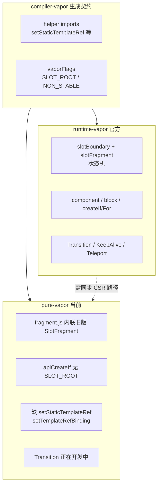

# pure-vapor 同步官方 Vapor 逻辑计划

## 背景与目标

[`packages/pure-vapor`](packages/pure-vapor) 是一个多月前从 [`packages/runtime-vapor`](packages/runtime-vapor) 移植的**纯 JS、零 runtime-dom 依赖**运行时。当前分支已合并官方 `minor`，`compiler-vapor` / `runtime-vapor` / `shared/vaporFlags` 在 **slot fallback 状态机、Transition、v-if/v-for flags、template ref** 等方面有大量更新（最近 40 条 commit 中 slot/Transition/hydration 占多数）。

**同步目标**：让 `runtimeModuleName: 'pure-vapor'` 下，CSR 应用行为与 `@vue/runtime-vapor` 一致。

**明确排除**（你已确认）：`vdomInterop.ts`、`dom/hydration.ts`、`hydrateFragment.ts`、`createVaporSSRApp`、Suspense、VDOM 互操作 slot 路径。hydration 相关分支在移植时**删除或 no-op**，保留 CSR 逻辑。

**不修改**：`compiler-vapor`、`runtime-vapor`、`vue` 包本身（与 [Plan1](.cursor/plans/pure-vapor_纯运行时_8015eb3b.plan.md) 一致）。

---

## 差距概览



### 模块行数差异（CSR 相关 Top 项）

| 官方模块 | RV 行数 | PV 行数 | 差距 | 优先级 |
|---------|--------|--------|------|--------|
| [`component.ts`](packages/runtime-vapor/src/component.ts) | 1332 | 624 | -708 | P1 |
| [`componentSlots.ts`](packages/runtime-vapor/src/componentSlots.ts) | 433 | 164 | -269 | P0 |
| [`slotFragment.ts`](packages/runtime-vapor/src/slotFragment.ts) | 315 | 0* | -315 | P0 |
| [`slotBoundary.ts`](packages/runtime-vapor/src/slotBoundary.ts) | 89 | 0* | -89 | P0 |
| [`apiCreateFor.ts`](packages/runtime-vapor/src/apiCreateFor.ts) | 803 | 496 | -307 | P1 |
| [`Transition.ts`](packages/runtime-vapor/src/components/Transition.ts) | 872 | 571 | -301 | P1 |
| [`apiCreateIf.ts`](packages/runtime-vapor/src/apiCreateIf.ts) | 129 | 50 | -79 | P1 |
| [`apiTemplateRef.ts`](packages/runtime-vapor/src/apiTemplateRef.ts) | 365 | 203 | -162 | P0 |
| [`block.ts`](packages/runtime-vapor/src/block.ts) | 380 | 253 | -127 | P1 |
| [`prop.ts`](packages/runtime-vapor/src/dom/prop.ts) | 725 | 373 | -352 | P2 |

\* pure-vapor 将 slot 逻辑**部分合并**在 [`fragment.js`](packages/pure-vapor/src/vapor/fragment.js)，但与官方近期 refactor（#14984–#15044 slot boundary 链、validity 状态机）**未对齐**。

### 已知 API 缺口

[`runtime-vapor/src/index.ts`](packages/runtime-vapor/src/index.ts) 导出、[`pure-vapor/src/index.js`](packages/pure-vapor/src/index.js) **缺失**：

- `setStaticTemplateRef`
- `setTemplateRefBinding`

[`compiler-vapor/src/generators/templateRef.ts`](packages/compiler-vapor/src/generators/templateRef.ts) 会生成上述调用；当前 pure-vapor 编译产物会在运行时报错。

### Flags 契约缺口

[`shared/src/vaporFlags.ts`](packages/shared/src/vaporFlags.ts) 新增/使用的 bit 在 pure-vapor 中**未处理**：

- `VaporIfFlags.SLOT_ROOT` — [`apiCreateIf.js`](packages/pure-vapor/src/vapor/apiCreateIf.js) 无 `trackSlotBoundary`
- `VaporVForFlags.SLOT_ROOT` — [`apiCreateFor.js`](packages/pure-vapor/src/vapor/apiCreateFor.js)
- `VaporSlotFlags.NON_STABLE` / `SLOT_ROOT` — [`componentSlots.js`](packages/pure-vapor/src/vapor/componentSlots.js)
- `VaporDynamicComponentFlags.SLOT_ROOT` — [`apiCreateDynamicComponent.js`](packages/pure-vapor/src/vapor/apiCreateDynamicComponent.js)

这些是 compiler-vapor 近期 slot tracking fix（#149xx 系列）的运行时配套。

### 测试覆盖缺口

pure-vapor 现有测试：~15 个 spec；runtime-vapor 有 ~51 个。pure-vapor **尚未移植**的高价值 CSR 测试：

- `componentSlots.spec.ts`（6300+ 行，slot fallback 核心）
- `dom/templateRef.spec.ts`（含 `setStaticTemplateRef`）
- `components/Teleport.spec.ts`、`components/KeepAlive.spec.ts`（跳过 interop/hydration 用例）
- `if.spec.ts` / `for.spec.ts` 中 Transition+KeepAlive 联动用例
- `apiCreateDynamicComponent.spec.ts`、`scopeId.spec.ts`、`dom/prop.spec.ts`

---

## 同步方法论

对每个文件对执行 **「diff → 移植 → 删 hydration/interop 分支 → 跑测试」**：

```
runtime-vapor/src/<Module>.ts
        ↓ 对照 diff
pure-vapor/src/vapor/<Module>.js   （或 internal/ 对应文件）
        ↓ 删除 isHydrating / vdomInterop 路径
        ↓ 可选 chaining ?. → 显式 guard（AGENTS.md）
        ↓ 移植/裁剪 runtime-vapor/__tests__/<Module>.spec.ts → pure-vapor/__tests__/
```

**internal/ 层**：pure-vapor 不依赖 runtime-core，但 VAPOR 相关逻辑分散在 [`runtime-dom/src/index.ts`](packages/runtime-dom/src/index.ts) VAPOR 段（Transition props、vShow、vModel、useCssVars）。对应 pure-vapor 的 [`internal/transitionDom.js`](packages/pure-vapor/src/internal/transitionDom.js)、[`internal/vShow.js`](packages/pure-vapor/src/internal/vShow.js) 等需在 P2 阶段对照 upstream 抽查。

**当前 WIP**：git status 显示 Transition 相关文件已在修改（`Transition.js`、`baseTransition.js`、`transitionRuntime.js`、`transition-vif.spec.js`）。同步计划应**先完成/合并当前 Transition 分支**，再以其为基线继续 slot 系统同步，避免重复劳动。

---

## 分阶段实施

### 阶段 0：基线审计（1–2 天）

1. **导出契约 diff**
   - 脚本或手工对比 [`runtime-vapor/src/index.ts`](packages/runtime-vapor/src/index.ts) vs [`pure-vapor/src/index.js`](packages/pure-vapor/src/index.js)（减去排除表）
   - 更新 [`exports.spec.js`](packages/pure-vapor/__tests__/exports.spec.js)：`REQUIRED_EXPORTS` 加入 `setStaticTemplateRef`、`setTemplateRefBinding`

2. **模块映射表**
   - 建立 RV↔PV 文件对照清单（含 `slotBoundary`/`slotFragment` 需从 `fragment.js` **拆出**为独立模块，与官方结构对齐以便后续 diff）

3. **跑通现有测试**
   ```bash
   vp run build pure-vapor
   vp run test pure-vapor
   ```

4. **compileSmoke 快照**
   - 用最新 `@vue/compiler-vapor` + `runtimeModuleName: 'pure-vapor'` 刷新 [`compileSmoke.spec.js.snap`](packages/pure-vapor/__tests__/__snapshots__/compileSmoke.spec.js.snap)
   - 确认生成代码 import 的符号 pure-vapor 均能解析

---

### 阶段 1：P0 — 编译器硬依赖（阻塞级）

| 任务 | 源文件 | 目标 |
|------|--------|------|
| Template Ref API | [`apiTemplateRef.ts`](packages/runtime-vapor/src/apiTemplateRef.ts) | 补齐 `setStaticTemplateRef`、`setTemplateRefBinding`；[`index.js`](packages/pure-vapor/src/index.js) 导出 |
| Slot 基础设施 | [`slotBoundary.ts`](packages/runtime-vapor/src/slotBoundary.ts) + [`slotFragment.ts`](packages/runtime-vapor/src/slotFragment.ts) | 新建 `vapor/slotBoundary.js`、`vapor/slotFragment.js`；从 [`fragment.js`](packages/pure-vapor/src/vapor/fragment.js) 迁出旧 `SlotFragment`，替换为官方状态机（**仅 vapor 路径，删 interop 三分支**） |
| Slot 出口 | [`componentSlots.ts`](packages/runtime-vapor/src/componentSlots.ts) | 全量同步 `createSlot`、`withVaporCtx`、NON_STABLE / forwarded slot 逻辑 |
| Block 辅助 | [`block.ts`](packages/runtime-vapor/src/block.ts) 中 `isValidSlot`、`trackSlotBoundaryDirtying` | 同步到 [`block.js`](packages/pure-vapor/src/vapor/block.js) |

**验收**：移植 `templateRef.spec.ts` 中 CSR 用例；移植 `componentSlots.spec.ts` 子集（排除 hydration/interop describe 块）。

---

### 阶段 2：P1 — 控制流 + 组件核心

| 任务 | 要点 |
|------|------|
| [`apiCreateIf.js`](packages/pure-vapor/src/vapor/apiCreateIf.js) | `SLOT_ROOT` → `DynamicFragment(..., trackSlotBoundary)`；`decodeIfShape`；删 hydration cursor |
| [`apiCreateFor.js`](packages/pure-vapor/src/vapor/apiCreateFor.js) | `SLOT_ROOT`、`IS_FRAGMENT` 等 flag 解码；`createSelector` / `createForSlots` 对齐 |
| [`apiCreateDynamicComponent.js`](packages/pure-vapor/src/vapor/apiCreateDynamicComponent.js) | `SLOT_ROOT`、KeepAlive 缓存 identity |
| [`fragment.js`](packages/pure-vapor/src/vapor/fragment.js) | `DynamicFragment.update` 与 slot boundary dirty 通知；与 Transition/KeepAlive 集成 |
| [`component.js`](packages/pure-vapor/src/vapor/component.js) | mount/update/unmount、attrs fallthrough、render effect 创建顺序（#14984）；KeepAlive context 从 owner 解析（#15023） |
| [`renderEffect.js`](packages/pure-vapor/src/vapor/renderEffect.js) | 与 component 联动修复 |

**验收**：移植 [`if.spec.ts`](packages/runtime-vapor/__tests__/if.spec.ts)、[`for.spec.ts`](packages/runtime-vapor/__tests__/for.spec.ts) 中 CSR + Transition/KeepAlive 用例；[`transition-vif.spec.js`](packages/pure-vapor/__tests__/transition-vif.spec.js) 扩展。

---

### 阶段 3：P1 — 内置组件（含当前 WIP）

以官方 [`components/Transition.ts`](packages/runtime-vapor/src/components/Transition.ts)、[`TransitionGroup.ts`](packages/runtime-vapor/src/components/TransitionGroup.ts) 为基准，**合并当前分支 Transition 改动**后 diff 补齐：

- key 解析、early-remove、v-show appear、slot fallback out-in
- 动态组件 leave 期间类型切换（[`different-type-during-leave.vue`](packages-private/vapor-e2e-test/transition/cases/dynamic-component/different-type-during-leave.vue)）

同步 [`KeepAlive.ts`](packages/runtime-vapor/src/components/KeepAlive.ts)、[`Teleport.ts`](packages/runtime-vapor/src/components/Teleport.ts)（CSR 路径；跳过 hydration anchor 逻辑）。

**internal/** 对照：[`baseTransition.js`](packages/pure-vapor/src/internal/baseTransition.js)、[`transitionDom.js`](packages/pure-vapor/src/internal/transitionDom.js)、[`transitionRuntime.js`](packages/pure-vapor/src/internal/transitionRuntime.js) 与 runtime-dom VAPOR 段一致。

**验收**：
- 移植 `Transition.spec.ts` / `TransitionGroup.spec.ts` CSR 用例
- 在 `packages-private/vapor-e2e-test/transition` 用 `vue: pure-vapor` alias 跑 vapor-only cases（跳过 interop 目录）

---

### 阶段 4：P2 — DOM 层与周边

| 模块 | 说明 |
|------|------|
| [`dom/prop.js`](packages/pure-vapor/src/vapor/dom/prop.js) | setClass/setDynamicProps 等（-352 行差距） |
| [`dom/event.js`](packages/pure-vapor/src/vapor/dom/event.js) | `eventDelegation` 默认 true 行为对齐 |
| [`scopeId.js`](packages/pure-vapor/src/vapor/scopeId.js) | scoped CSS |
| [`componentProps.js`](packages/pure-vapor/src/vapor/componentProps.js) | attrs/props 规范化 |
| [`apiDefineComponent.js`](packages/pure-vapor/src/vapor/apiDefineComponent.js) | 与官方 defineVaporComponent 对齐（-212 行） |
| [`apiDefineCustomElement.js`](packages/pure-vapor/src/vapor/apiDefineCustomElement.js) | CE 生命周期（无 SSR CE） |

**验收**：移植 `prop.spec.ts`、`scopeId.spec.ts`、`customElement.spec.ts` 子集。

---

### 阶段 5：文档与持续同步机制

1. 更新 [`README.md`](packages/pure-vapor/README.md) 与 [Plan3 不兼容清单](.cursor/plans/pure-vapor_不兼容清单_caf3e54a.plan.md)（Transition 已支持、template ref 新导出）
2. 在 pure-vapor 增加 **「upstream 同步清单」** markdown（或 README 一节）：RV 文件 ↔ PV 文件 ↔ 最后同步 commit
3. **CI 建议**：`vp run test pure-vapor` + 可选 `compileSmoke` 快照 gate
4. **后续维护**：每次合并 official minor 后，对 `git log packages/runtime-vapor` 新 commit 按模块 cherry-pick 逻辑到 pure-vapor

---

## 建议 PR 拆分

| PR | 内容 | 风险 |
|----|------|------|
| PR-1 | 阶段 0 + template ref API + exports | 低 |
| PR-2 | slotBoundary/slotFragment + componentSlots | 高（行为面最大） |
| PR-3 | createIf/For/DynamicComponent + fragment/block | 高 |
| PR-4 | component.js + renderEffect | 高 |
| PR-5 | Transition/KeepAlive/Teleport（合入当前 WIP） | 中 |
| PR-6 | DOM prop/event + 剩余测试移植 | 中 |

每个 PR：`vp run build pure-vapor && vp run test pure-vapor`。

---

## 与现有 Plan 的关系

| 文档 | 关系 |
|------|------|
| [Plan1 纯运行时](.cursor/plans/pure-vapor_纯运行时_8015eb3b.plan.md) | 架构/导出契约不变；本计划是 **upstream 行为追平** |
| [Plan2 二期精简](.cursor/plans/pure-vapor_二期精简_bdd218a4.plan.md) | `app._Internal` 多 App 隔离可与 P1 并行，但不阻塞 slot 同步 |
| [Plan3 不兼容清单](.cursor/plans/pure-vapor_不兼容清单_caf3e54a.plan.md) | 同步完成后更新「编译器陷阱」与「已实现」表 |

---

## 风险与缓解

| 风险 | 缓解 |
|------|------|
| slot 状态机移植复杂 | 先移植官方测试再写代码；按 slotBoundary → slotFragment → componentSlots 顺序 |
| hydration 分支误删 CSR 逻辑 | 移植时保留 `if (isHydrating)` 的 **else 分支**为默认路径 |
| Transition WIP 与官方 diff 冲突 | 先 rebase 当前 Transition 改动到最新 runtime-vapor，再 diff |
| internal/ 与 runtime-core 漂移 | 仅对 vapor 实际调用的 internal 模块做 targeted diff |
| 测试量过大 | 按 describe 块裁剪 interop/hydration；优先 compiler 驱动测试（`compileToPureVaporRender`） |
