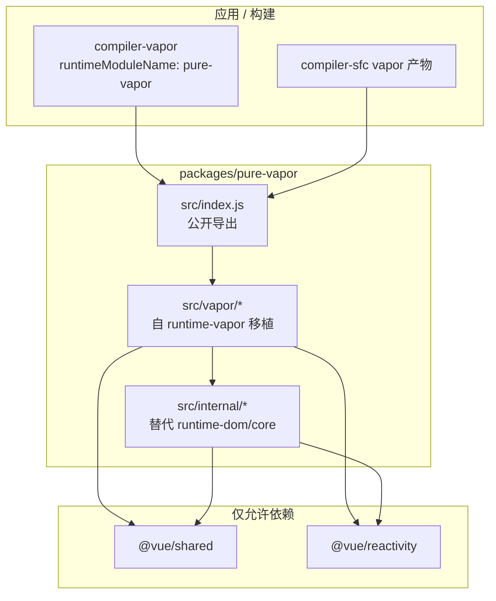

# pure-vapor 纯 Vapor 运行时框架计划

## 目标与约束

| 约束 | 方案 |
|------|------|
| 不修改 `compiler-*`、`runtime-*` | 仅新增 [`packages/pure-vapor`](packages/pure-vapor)；消费方通过 `compiler-vapor` 的 `runtimeModuleName: 'pure-vapor'`（或 Vite alias）指向本包 |
| 仅依赖 `shared`、`reactivity` | 所有原 `@vue/runtime-dom` / `runtime-core` 能力在 `pure-vapor/src/internal/` 内最小化自实现 |
| 不兼容 VNode / SSR / devtools / VDOM 互操作 | 剔除对应模块与导出；`createVaporSSRApp`、`defineVaporSSRCustomElement`、`vaporInteropPlugin`、hydration、`vdomInterop*` 不实现 |
| 不实现 Suspense | 不导出 `Suspense`；若模板使用 `<Suspense>`，在文档中标注不支持（编译器仍会生成 import，需在应用层避免） |
| API 名兼容 `runtime-vapor` | [`packages/runtime-vapor/src/index.ts`](packages/runtime-vapor/src/index.ts) 中的导出名称保持一致（仅去掉排除项） |
| JavaScript | 全部 `src/**/*.js`，无 `.ts`；`package.json` 不设 `types` 字段 |
| 包名 | `"name": "pure-vapor"`，目录 `packages/pure-vapor`（符合 [`pnpm-workspace.yaml`](pnpm-workspace.yaml) 的 `packages/*`） |

## 架构总览



**核心思路**：以 [`packages/runtime-vapor`](packages/runtime-vapor) 为功能蓝本，按文件一对一移植为 JS，同时将 33 处 `from '@vue/runtime-dom'` 改为 `from '../internal/...'`；`internal/` 只实现 Vapor 实际用到的 runtime-core 子集（调度器、当前实例、资源解析、错误边界、emit/props 规范化、Transition DOM 动画钩子、scoped id 等）。

## 导出契约

### 1. 与 `runtime-vapor` 对齐的导出（来自 [`index.ts`](packages/runtime-vapor/src/index.ts)）

**保留（公开 + compiler-use）**：

- App / 定义：`createVaporApp`、`defineVaporComponent`、`defineVaporAsyncComponent`、`defineVaporCustomElement`、`VaporElement`
- 内置组件：`VaporTeleport`、`VaporKeepAlive`、`VaporTransition`、`VaporTransitionGroup`
- 编译器 helpers：`insert`、`prepend`、`remove`、`setInsertionState`、`createComponent*`、`renderEffect`、`createSlot`、`withVaporCtx`、`template`、`child`/`nthChild`/`next`/`txt`、`setText`/`setProp`/… 全套 DOM helpers、`createIf`、`createFor*`、`createKeyedFragment`、`setBlockKey`、`createTemplateRefSetter`、`applyVShow`、`apply*Model`、`withVaporDirectives`、`isFragment`、`VaporFragment`、`DynamicFragment`、`delegateEvents`、`withVaporModifiers`、`withVaporKeys`、`useVaporCssVars`、`withAsyncContext` 等

**剔除**：

| 导出 | 原因 |
|------|------|
| `createVaporSSRApp` | 无 SSR |
| `defineVaporSSRCustomElement` | 无 SSR |
| `vaporInteropPlugin` | 无 VDOM 互操作 |
| `createVaporSSRApp` 相关 hydration | 无 SSR / 注水 |

> 说明：用户提到的「compact」在仓库 `runtime-vapor` 中无对应逻辑，计划中按 **不包含 `vue-compat` 兼容层** 处理；若指其他特性请后续补充。

### 2. 编译器额外需要的 CoreHelper（当前由 `vue` / `runtime-dom` 提供）

[`compiler-vapor`](packages/compiler-vapor) 生成代码时除 VaporHelper 外还会 import（见 [`generate.ts`](packages/compiler-vapor/src/generate.ts) 与各 generator）：

| 符号 | 实现位置建议 |
|------|----------------|
| `resolveComponent`、`resolveDirective`、`resolveDynamicComponent` | `internal/resolveAssets.js`（参考 [`runtime-core/src/helpers/resolveAssets.ts`](packages/runtime-core/src/helpers/resolveAssets.ts)） |
| `toDisplayString` | `internal/toDisplayString.js` |
| `toHandlers` | `internal/toHandlers.js` |
| `withModifiers`、`withKeys` | `internal/eventModifiers.js`（组件 props 事件路径；与 `withVaporModifiers`/`withVaporKeys` 并存） |
| `isRef`、`unref` | 从 `@vue/reactivity` **re-export** |
| `camelize`、`toHandlerKey` | 从 `@vue/shared` **re-export** |
| `Suspense` | **不导出**（用户确认忽略） |

`index.js` 统一聚合上述符号，保证 `import { ... } from 'pure-vapor'` 与现有 vapor 快照一致（仅缺 `Suspense`）。

## 目录结构（建议）

```
packages/pure-vapor/
├── package.json          # name: pure-vapor, deps: shared + reactivity
├── index.js              # 指向 dist 占位（与其它包一致）
├── README.md
├── src/
│   ├── index.js          # 公开导出入口
│   ├── internal/         # 替代 runtime-dom/core（不对外文档化）
│   │   ├── scheduler.js      # queueJob, queuePostFlushCb, SchedulerJobFlags
│   │   ├── instance.js       # currentInstance, setCurrentInstance, lifecycle
│   │   ├── errorHandling.js  # callWithErrorHandling, warn, ErrorCodes
│   │   ├── app.js            # createAppAPI, normalizeContainer, flushOnAppMount
│   │   ├── resolveAssets.js
│   │   ├── props.js          # normalizePropsOptions, 校验（精简版）
│   │   ├── emit.js           # baseEmit
│   │   ├── transition.js     # performTransitionEnter/Leave 等
│   │   └── scopeId.js
│   └── vapor/            # 自 runtime-vapor 移植（文件名对应）
│       ├── block.js
│       ├── component.js
│       ├── renderEffect.js
│       ├── dom/
│       ├── directives/
│       ├── components/
│       └── ...
└── __tests__/            # Vitest + JS，模板编译快照驱动
```

## 实现策略（全量对齐，按模块分批合并）

### 阶段 A：包脚手架与 `internal` 基座

1. 新增 [`packages/pure-vapor/package.json`](packages/pure-vapor/package.json)：
   - `"name": "pure-vapor"`
   - `dependencies`: `@vue/shared`, `@vue/reactivity`（`workspace:*`）
   - `buildOptions`: `{ "name": "PureVapor", "formats": ["esm-bundler"] }`（与 [`runtime-vapor/package.json`](packages/runtime-vapor/package.json) 一致）
   - **无** `peerDependencies`、**无** `types`
2. `src/index.js` 先导出 CoreHelper + 空桩，确保 `vp run build pure-vapor` 可通过（构建脚本 [`scripts/utils.js`](scripts/utils.js) 会自动发现 `packages/*` 新包）。
3. 实现 `internal/scheduler.js`、`internal/instance.js`、`internal/errorHandling.js`、`internal/app.js`——这是 [`renderEffect.js`](packages/runtime-vapor/src/renderEffect.ts)、[`component.js`](packages/runtime-vapor/src/component.ts) 的硬依赖。

### 阶段 B：Vapor DOM 与 Block 核心（编译器最频繁路径）

按依赖顺序移植为 JS（删除类型、去掉 `?.`，符合 AGENTS.md 运行时规范）：

| 模块 | 源文件 | 要点 |
|------|--------|------|
| 模板克隆 | `dom/template.js` | 去掉 `hydration.ts` 引用；`withHydration` 改为 no-op 或直接删除调用链 |
| 节点定位 | `dom/node.js` | `child`/`nthChild`/`next`/`txt` |
| 属性/事件 | `dom/prop.js`, `dom/event.js` | `optimizePropertyLookup` 保留；`patchStyle` 等从 internal 提供 |
| Block | `block.js`, `insertionState.js` | `insert`/`remove`/`prepend` |
| 副作用 | `renderEffect.js` | `RenderEffect extends ReactiveEffect` |
| 控制流 | `apiCreateIf.js`, `apiCreateFor.js`, `apiCreateFragment.js`, `helpers/setKey.js` | 与快照行为一致 |

### 阶段 C：组件系统

| 模块 | 源文件 |
|------|--------|
| 实例 | `component.js`, `componentProps.js`, `componentEmits.js`, `componentSlots.js` |
| API | `apiDefineComponent.js`, `apiDefineAsyncComponent.js`, `apiCreateDynamicComponent.js`, `apiSetupHelpers.js`, `apiTemplateRef.js` |
| Fragment | `fragment.js` |
| App | `apiCreateApp.js`（仅 `createVaporApp`；删除 `prepareApp` 中 `setDevtoolsHook` / `__VUE_DEVTOOLS` 分支） |

**不移植**：`hmr.js`（可选：若需 dev HMR 可二期；用户未要求且利于体积）、`refCleanup.js` 按需保留。

### 阶段 D：内置组件与指令（全量对齐所需）

| 模块 | 说明 |
|------|------|
| `components/Teleport.js`, `KeepAlive.js`, `Transition.js`, `TransitionGroup.js` | 依赖 `internal/transition.js` |
| `directives/vShow.js`, `vModel.js`, `custom.js` | v-model 全系列 `apply*Model` |
| `helpers/useCssVars.js` | SFC `useVaporCssVars` 注入需要 |
| `apiDefineCustomElement.js` | 保留客户端 CE；去掉 SSR CE |

**明确跳过**：`suspense.ts`、`vdomInterop*.ts`、`dom/hydration.ts`。

### 阶段 E：公开入口与构建验证

[`src/index.js`](packages/pure-vapor/src/index.js) 对照 [`runtime-vapor/src/index.ts`](packages/runtime-vapor/src/index.ts) 逐项 `export`，并追加 CoreHelper / shared / reactivity 的 re-export。

验证命令（实现期执行）：

```bash
pnpm i
vp run build pure-vapor
vp run test pure-vapor
```

## 测试策略（不修改 compiler 包）

1. **快照回归**：在 `packages/pure-vapor/__tests__/` 用 `compiler-vapor` 的 `compile()` 编译 fixture 模板，设置 `runtimeModuleName: 'pure-vapor'`，对生成的 `render` 做 smoke test（`new Function` + 简单 `createVaporApp` 挂载）。
2. **移植关键单测**：优先移植 [`packages/runtime-vapor/__tests__/`](packages/runtime-vapor/__tests__/) 中与 DOM 更新、v-for/v-if、组件、指令相关的用例（改为 JS + 指向 `pure-vapor`）。
3. **可选**：在 `packages-private/` 增加最小 vapor playground（仅文档说明，不强制进主 CI），演示 Vite alias：

```js
// vite.config.js 示例
resolve: { alias: { vue: 'pure-vapor' } }
// 或在 compileTemplate 中: runtimeModuleName: 'pure-vapor'
```

## 与现有仓库的集成边界

| 项 | 做法 |
|----|------|
| 修改 `compiler-vapor` 默认 import | **不做**；由应用在编译选项传入 `runtimeModuleName` |
| 修改 `vue` 包 | **不做** |
| 修改 `runtime-vapor` | **不做** |
| 根 `package.json` scripts | 可选增加 `vp run build pure-vapor` 文档说明；非必须 |
| TypeScript 类型 | 不提供 `.d.ts`；使用者可用 JSDoc 或自行声明模块 |

## 风险与缓解

| 风险 | 缓解 |
|------|------|
| `internal/` 与 upstream `runtime-core` 行为漂移 | 以 `runtime-vapor` 现有单测为黄金标准；关键路径写回归测试 |
| 全量移植工作量大（~40 文件 × runtime-dom 耦合） | 按阶段 A→E 合 PR；每阶段可运行 build + 部分测试 |
| `<Suspense>` 模板仍可编译但运行失败 | README 明确不支持；长期可在 compiler 侧由用户自行配置（不在本任务改 compiler） |
| 无 TypeScript 导致维护成本 | 保持与 `runtime-vapor` 文件结构平行，便于 diff 同步 |
| `__DEV__` / feature flags | 构建时沿用 monorepo 的 `__DEV__` 替换；去掉 devtools / prod devtools 分支 |

## 预期成果

- 独立包 `pure-vapor`：仅 `shared` + `reactivity`，纯 JS，ESM bundler 构建产物。
- 导出集合 ≈ `runtime-vapor` 公开 API（减去 SSR / interop / devtools）+ compiler 所需 CoreHelper（ minus `Suspense`）。
- 可运行由 `compiler-vapor` 生成的 vapor 组件（在配置 `runtimeModuleName: 'pure-vapor'` 时），无 VNode 运行时依赖，包体积与调用链更短。
