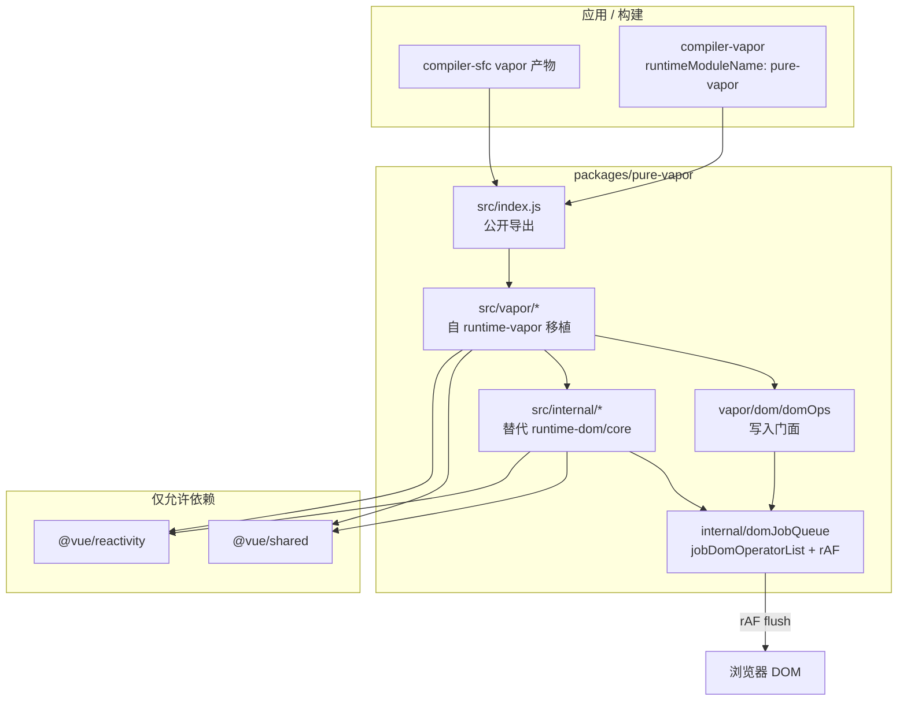
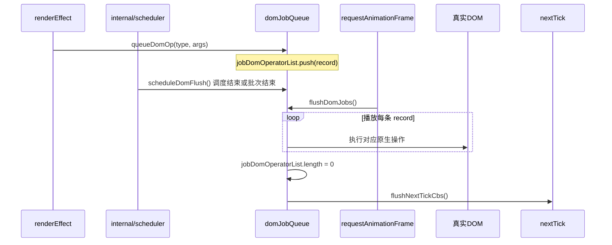
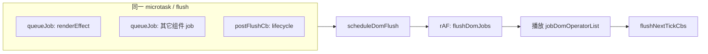
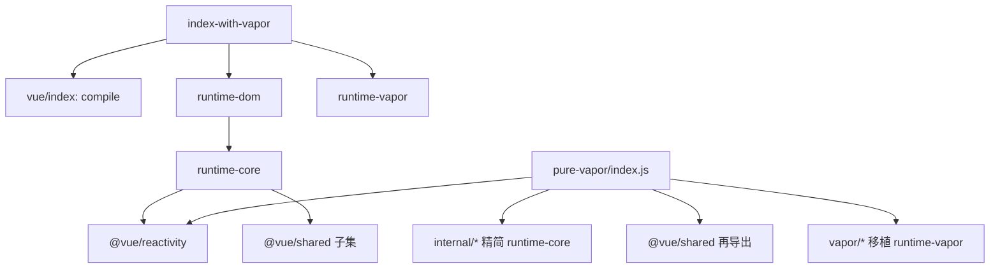

# pure-vapor 纯 Vapor 运行时框架计划

## 目标与约束

| 约束 | 方案 |
|------|------|
| 不修改 `compiler-*`、`runtime-*` | 仅新增 [`packages/pure-vapor`](packages/pure-vapor)；它是一个全新的运行时，它只需要兼容 compiler-vapor 编译后的产物即可。不需要兼容传统的vnode的组件 |
| 仅依赖 `shared`、`reactivity` | 所有原 `@vue/runtime-dom` / `runtime-core` 能力在 `pure-vapor/src/internal/` 内最小化自实现 |
| 不兼容 VNode / SSR / devtools / VDOM 互操作 | 剔除对应模块与导出；`createVaporSSRApp`、`defineVaporSSRCustomElement`、`vaporInteropPlugin`、hydration、`vdomInterop*` 不实现 |
| 不实现 Suspense | 不导出 `Suspense`；若模板使用 `<Suspense>`，在文档中标注不支持（编译器仍会生成 import，需在应用层避免） |
| 首版不做 Transition | 不实现、不导出 `VaporTransition` / `VaporTransitionGroup`；不引入 `internal/transition.js` 及 `block` 中 Transition 专用分支；与 runtime 的 enter/leave 动画钩子解耦 |
| 仅 Composition API / setup | Vapor 组件只支持 `<script setup>`（及编译期宏）；**不支持** Options API 对象语法（`data` / `methods` / `computed` / `watch` 等 options 字段、`extends`、**mixins**） |
| 不支持 mixins | `createVaporApp` 不提供 `app.mixin()`；`AppContext` 不含 `mixins` / `optionMergeStrategies` / `optionsCache`；与 `runtime-vapor` 一致（options 归一化缓存在组件 `__propsOptions` / `__emitsOptions` 上，而非 app 级 mixin 合并） |
| 公开 API 基准 | 以 [`vue/src/index-with-vapor.ts`](packages/vue/src/index-with-vapor.ts) 为准：`./index`（`compile` + `runtime-dom` → `runtime-core`）+ `@vue/runtime-vapor`；实现落在 `pure-vapor/src/index.js`，**减去**下文排除表 |
| Vapor 运行时符号 | [`runtime-vapor/src/index.ts`](packages/runtime-vapor/src/index.ts) 中符号名保持不变（**减去** SSR / interop / Suspense / Transition） |
| JavaScript | 全部 `src/**/*.js`，无 `.ts`；`package.json` 不设 `types` 字段 |
| 包名 | `"name": "pure-vapor"`，目录 `packages/pure-vapor`（符合 [`pnpm-workspace.yaml`](pnpm-workspace.yaml) 的 `packages/*`） |

## 架构总览



**核心思路**：以 [`packages/runtime-vapor`](packages/runtime-vapor) 为功能蓝本，按文件一对一移植为 JS，同时将 33 处 `from '@vue/runtime-dom'` 改为 `from '../internal/...'`；`internal/` 只实现 Vapor 实际用到的 runtime-core 子集（调度器、当前实例、资源解析、错误边界、emit/props 规范化、scoped id 等）。**首版刻意不移植 Transition 运行时**（`transition.ts`、`components/Transition*`、`internal/transition.js`），`block.js` 仅保留无动画的 insert/remove 路径。

**pure-vapor 差异化**：相对 `runtime-vapor` 的同步 DOM 写入，pure-vapor 引入 **DOM Job 队列 + rAF 批量播放**，在 App 挂载、组件 mount/update/unmount、`renderEffect` 回调等路径中，DOM 变更先入队、再在下一帧统一落盘，播放结束后触发 `nextTick`。

## DOM 批量调度机制（jobDomOperatorList）

### 目标

将分散的 DOM 写操作合并为「记录 → 播放」两阶段，减少布局抖动与强制同步布局，使一次响应式更新周期内的 DOM 变更在同一 `requestAnimationFrame` 中完成。

### 数据流



### 核心模块：`src/internal/domJobQueue.js`

| 符号 | 职责 |
|------|------|
| `jobDomOperatorList` | 当前待播放的 DOM 操作记录数组（模块内私有，可通过 `getPendingDomOpCount()` 等仅测试用接口观测） |
| `queueDomOp(type, payload)` | 入队一条可播放记录 |
| `flushDomJobs()` | 顺序播放 `jobDomOperatorList`，清空数组，调用 `flushNextTickCbs()` |
| `scheduleDomFlush()` | 若尚未预约，则 `requestAnimationFrame(flushDomJobs)`（同帧合并为一次 flush） |
| `runWithDomOps(fn)` | 同步执行 `fn`（其中 DOM 仅入队），结束后 `scheduleDomFlush()` |

`nextTick` 实现在 [`internal/scheduler.js`](packages/pure-vapor/src/internal/scheduler.js)：`nextTick(cb)` 将回调登记到 `nextTickCbs`，**仅在 `flushDomJobs` 末尾** 与 DOM 播放绑定——保证 `nextTick` 回调执行时 DOM 已真实更新（语义上对齐「DOM 更新后的 nextTick」，但触发时机为 rAF 之后而非 microtask）。

### 操作记录格式（可播放）

每条记录为普通对象，通过 `type` 分发到播放器：

```js
// 示例结构（实现期可扩展 DomOpType 常量表）
{ type: 'insertBefore', parent, node, anchor }
{ type: 'removeChild', parent, child }
{ type: 'appendChild', parent, child }
{ type: 'setText', node, text }
{ type: 'setAttribute', el, name, value }
{ type: 'removeAttribute', el, name }
{ type: 'setProperty', el, key, value }      // el[key] = value
{ type: 'className', el, value }
{ type: 'style', el, property, value }       // el.style[prop] = value
{ type: 'addEventListener', el, event, handler, options }
// Teleport 等复杂路径可拆为多条 primitive op 或专用 type + handler
```

播放器 `playDomOp(record)` 用 `switch (record.type)` 调用对应原生 API；**禁止**在 `queueDomOp` 路径上触碰真实 DOM（读布局同理需谨慎，见风险节）。

### DOM 写入门面：`src/vapor/dom/domOps.js`

所有会修改 DOM 的公开/内部 helper **统一经 `domOps` 导出**，不再在业务代码里直接 `parent.insertBefore` / `el.textContent =`：

| 门面函数 | 入队 op | 原对应 |
|----------|---------|--------|
| `domInsert` / `domRemove` / `domPrepend` | `insertBefore` / `removeChild` 等 | [`block.js`](packages/runtime-vapor/src/block.ts) `insert`/`remove`/`prepend` |
| `domSetText` / `domSetAttr` / … | `setText` / `setAttribute` / … | [`dom/prop.js`](packages/runtime-vapor/src/dom/prop.ts) |
| `domMountClear` 等 | 专用 op | [`apiCreateApp.js`](packages/runtime-vapor/src/apiCreateApp.ts) 挂载前清空容器 |

对外 API 名称不变（仍导出 `insert`、`setText` 等），其实现改为调用 `domOps` → `queueDomOp`。

### 入队边界（必须覆盖的路径）

| 场景 | 包裹方式 |
|------|----------|
| **App 加载** | `createVaporApp().mount()` → `runWithDomOps(() => mountComponent(...))` |
| **组件加载** | `mountComponent` 内 block 插入、子树挂载 |
| **组件更新** | `renderEffect` 的 `render()` 回调体（含编译器生成的 `setProp`/`setText`/`insert`） |
| **组件删除** | `unmountComponent` → `remove` 链 |
| **控制流** | `createIf` / `createFor` / `createKeyedFragment` 的 block 增删 |
| **内置组件** | Teleport 的 DOM 移动：优先拆为 primitive op；若必须同步读 DOM，在播放器阶段或 `flushDomJobs` 之后执行 |

`renderEffect` 调度逻辑保持：`notify` → `queueJob` → 同步执行 `render()`（其中 DOM 仅入队）；在 **当前 scheduler flush 结束** 时调用 `scheduleDomFlush()`（在 `internal/scheduler.js` 的 flush 末尾挂钩），将本 tick 内累积的 op 合并到下一帧播放。

### 与 scheduler 的配合



- 同一 flush 周期内多次 `scheduleDomFlush` 只注册 **一个** rAF 回调。
- `inOnceSlot` 等需同步 DOM 的路径：可用 `runWithDomOpsSync`（立即 `flushDomJobs`）作为逃生舱，仅用于明确必须同步的极少数内部逻辑；默认仍走批量。

### 导出

- `nextTick`：作为 pure-vapor 公开 API 导出（`runtime-vapor` 无此导出，属 pure-vapor 扩展；不破坏现有 vapor helper 名称）。
- 可选 `flushDomJobs` 仅 `__TEST__` 或内部测试用于不等待 rAF 的断言。

## 导出契约

### 基准：`index-with-vapor.ts` 展开

[`vue/src/index-with-vapor.ts`](packages/vue/src/index-with-vapor.ts) 等价于：

```ts
export * from './index'              // compile + @vue/runtime-dom（含 runtime-core 再导出）
export * from '@vue/runtime-vapor'
```

其中 [`vue/src/index.ts`](packages/vue/src/index.ts) 额外提供 `compile`（运行时模板编译），[`runtime-dom`](packages/runtime-dom/src/index.ts) 再 `export * from '@vue/runtime-core'`。

**pure-vapor 目标**：在 `src/index.js` 聚合上述联合体里、**Vapor 应用与 `compiler-vapor` 实际会用到**的符号，使 `runtimeModuleName: 'pure-vapor'` 或 `resolve.alias: { vue: 'pure-vapor' }` 时，常见 `import { ref, reactive, createVaporApp, … } from 'vue'` 可改为从 `pure-vapor` 单包解析。



### 1. 保留：三层来源

#### A. `@vue/reactivity` — 完整再导出（与 `runtime-core` 一致）

自 [`runtime-core/src/index.ts`](packages/runtime-core/src/index.ts) 对 reactivity 的公开块 **原样 re-export**，包括但不限于：

`reactive`、`ref`、`readonly`、`unref`、`proxyRefs`、`isRef`、`toRef`、`toValue`、`toRefs`、`isProxy`、`isReactive`、`isReadonly`、`isShallow`、`customRef`、`triggerRef`、`shallowRef`、`shallowReactive`、`shallowReadonly`、`markRaw`、`toRaw`、`effect`、`stop`、`getCurrentWatcher`、`onWatcherCleanup`、`ReactiveEffect`、`effectScope`、`EffectScope`、`getCurrentScope`、`onScopeDispose`。

> 实现：`export { … } from '@vue/reactivity'`，不复制实现。

#### B. `runtime-core` 公开子集 — 在 `internal/` 实现或再导出

与 Vapor 组件 / `<script setup>` / 编译产物相关的符号（参考 `runtime-core` + `runtime-dom` 对应用代码的公开面）：

| 类别 | 保留符号 |
|------|----------|
| 元信息 | `version` |
| 计算与侦听 | `computed`、`watch`、`watchEffect`、`watchPostEffect`、`watchSyncEffect` |
| 生命周期 | `onBeforeMount`、`onMounted`、`onBeforeUpdate`、`onUpdated`、`onBeforeUnmount`、`onUnmounted`、`onActivated`、`onDeactivated`、`onRenderTracked`、`onRenderTriggered`、`onErrorCaptured` |
| 依赖注入 | `provide`、`inject`、`hasInjectionContext` |
| 调度 | `nextTick`（pure-vapor：**DOM flush 后**触发，见上文 DOM 队列节） |
| 组合式工具 | `useAttrs`、`useSlots`、`useModel`、`useTemplateRef`、`useId` |
| `<script setup>` 宏运行时 | `defineProps`、`defineEmits`、`defineExpose`、`defineSlots`、`defineModel`、`withDefaults`；`defineOptions` 仅作**编译期宏** no-op stub（写入 `name` / `inheritAttrs` 等元数据），**不是** Options API 运行时 |
| 实例 | `getCurrentInstance` |
| 异步 setup | `withAsyncContext`（与 runtime-vapor 一致，非仅类型） |
| 资源解析 / 编译器 CoreHelper | `resolveComponent`、`resolveDirective`、`resolveDynamicComponent`、`NULL_DYNAMIC_COMPONENT` |
| 模板辅助 | `toDisplayString`、`toHandlers` |
| 事件修饰符（组件 props 路径） | `withModifiers`、`withKeys`（与 `withVaporModifiers` / `withVaporKeys` 并存） |
| SFC CSS（若 e2e / 用户需要） | `useCssModule`（自 `internal` 或精简移植） |

**`@vue/shared` 再导出**（与 `runtime-core` 对编译器/模板暴露的子集对齐，非 `shared` 全量）：

`camelize`、`capitalize`、`hyphenate`、`toHandlerKey`、`toDisplayString`、`normalizeProps`、`normalizeClass`、`normalizeStyle`。

> `capitalize` 仅在编译器内部使用，不会出现在 `render()` 的 helper import 中；再导出是为了 `vue` → `pure-vapor` alias 时 `<script setup>` 与工具库写法一致。

#### C. `@vue/runtime-vapor` — 全量移植（减去排除表）

[`runtime-vapor/src/index.ts`](packages/runtime-vapor/src/index.ts) 中的 **VaporHelper + 公开 API**，包括但不限于：

- App / 定义：`createVaporApp`、`defineVaporComponent`、`defineVaporAsyncComponent`、`defineVaporCustomElement`、`VaporElement`
- 内置组件：`VaporTeleport`、`VaporKeepAlive`
- 编译器 helpers：`insert`、`prepend`、`remove`、`setInsertionState`、`createComponent*`、`renderEffect`、`createSlot`、`withVaporCtx`、`template`、`child` / `nthChild` / `next` / `txt`、`setText` / `setProp` / …、`createIf`、`createFor*`、`createKeyedFragment`、`setBlockKey`、`createTemplateRefSetter`、`applyVShow`、`apply*Model`、`withVaporDirectives`、`isFragment`、`VaporFragment`、`DynamicFragment`、`delegateEvents`、`withVaporModifiers`、`withVaporKeys`、`useVaporCssVars` 等

### 2. 剔除：相对 `index-with-vapor` 不导出

以下在 `index-with-vapor` 链路中存在，但 **pure-vapor 不实现、不导出**（实现期不得出现在 `src/index.js`）：

| 类别 | 不导出符号（示例） | 原因 |
|------|-------------------|------|
| 运行时编译 | `compile` | 属 `vue` 全量包 + `@vue/compiler-dom`；pure-vapor 仅运行时 |
| VDOM 渲染 | `h`、`createVNode`、`cloneVNode`、`mergeProps`、`isVNode`、`Fragment`、`Text`、`Comment`、`Static`、`openBlock`、`createBlock`、`createElementVNode`、`createElementBlock`、`createTextVNode`、`createCommentVNode`、`createStaticVNode`、`guardReactiveProps`、`renderList`、`renderSlot`、`createSlots`、`withMemo`、`isMemoSame`、`withCtx`、`pushScopeId`、`popScopeId`、`withScopeId` | 无 VNode 运行时 |
| VDOM App | `createApp`、`render`、`hydrate` | 仅 `createVaporApp` |
| SSR | `createSSRApp`、`createVaporSSRApp`、`defineSSRCustomElement`、`defineVaporSSRCustomElement`、`useSSRContext`、`ssrContextKey`、`ssrUtils`、`onServerPrefetch`、`hydrateOnIdle`、`hydrateOnVisible`、`hydrateOnMediaQuery`、`hydrateOnInteraction`、`createHydrationRenderer`、`setIsHydratingEnabled` | 无 SSR |
| VDOM 内置组件 | `Teleport`、`KeepAlive`、`Suspense`、`BaseTransition`、`Transition`、`TransitionGroup` | Vapor 使用 `Vapor*` 对应项；`Suspense` 明确不做 |
| Vapor 剔除 | `VaporTransition`、`VaporTransitionGroup`、`vaporInteropPlugin` | 首版不做 Transition；无 VDOM 互操作 |
| VDOM 指令 / CE | `withDirectives`、`vShow`、`vModelText`、`vModelCheckbox`、`vModelRadio`、`vModelSelect`、`vModelDynamic`、`defineCustomElement`、`VueElement`、`useShadowRoot`、`useHost` | Vapor 使用 `apply*` / `defineVaporCustomElement` |
| Options API / mixins | `app.mixin()`、`__FEATURE_OPTIONS_API__`、app 级 `mixins` / `optionMergeStrategies` / `optionsCache` | Vapor 仅 setup；与 upstream `runtime-vapor` 相同，不做 mixin 合并 |
| 互操作 / 兼容 | `vdomInterop*`、`compatUtils`、`DeprecationTypes`、`resolveFilter` | 无 compat / interop |
| Devtools | `devtools`、`setDevtoolsHook` | 不实现 devtools |
| Feature flags | `initFeatureFlags`、`internal/featureFlags.js` | 不实现 devtools / SSR / hydration；无需 `__FEATURE_PROD_DEVTOOLS__`、`__FEATURE_PROD_HYDRATION_MISMATCH_DETAILS__` 等编译期注入与全局默认值；`createVaporApp` 的 `prepareApp` 不调用 `initFeatureFlags` |
| 编译器注册 | `registerRuntimeCompiler`、`isRuntimeOnly` | 无内置 compile |
| Transition 运行时钩子 | `useTransitionState`、`resolveTransitionHooks`、`setTransitionHooks`、`getTransitionRawChildren` | 随 Transition 剔除 |
| 自定义渲染器 | `createRenderer`、`MoveType`、`transformVNodeArgs` | Vapor 非可插拔 renderer API |
| `@internal` 泄漏 | `runtime-dom` / `runtime-core` 中带 `@internal` 的导出（如 `ensureRenderer`、`nodeOps`、`patchProp`、`mergeDefaults` 等） | 仅内部使用 |

> **Transition**：[`compiler-vapor` 的 `utils.ts`](packages/compiler-vapor/src/utils.ts) 仍可能生成 `VaporTransition` import；本包不导出，文档标明需在应用层避免。  
> **Suspense**：同上，不导出 `Suspense` / `VaporSuspense`。

### 3. 可选：迁移别名（非必须，exports-index 阶段决定）

为降低 `vue` → `pure-vapor` alias 的摩擦，可 **额外** 导出别名（不改变 Vapor  canonical 名称）：

| 别名 | 指向 |
|------|------|
| `createApp` | `createVaporApp` |
| `defineComponent` | `defineVaporComponent` |
| `defineAsyncComponent` | `defineVaporAsyncComponent` |
| `useCssVars` | `useVaporCssVars` |

未列入上表则 **不提供** VDOM 名称的兼容导出。

### 4. `src/index.js` 聚合方式（exports-index 阶段）

```js
// 1) 依赖包再导出
export { … } from '@vue/reactivity'
export { camelize, capitalize, … } from '@vue/shared'

// 2) internal 子集（runtime-core 等价）
export { version, computed, watch, … } from './internal/…'

// 3) vapor 实现（runtime-vapor 等价，减排除表）
export { createVaporApp, insert, renderEffect, … } from './vapor/…'
```

脚手架阶段可暂用 stub；**exports-index** todo 按本契约逐项对齐，并以 `compiler-vapor` 快照 + `vapor-e2e-test` 中 `from 'vue'` 的 import 做冒烟核对。

## 目录结构（建议）

```
packages/pure-vapor/
├── package.json          # name: pure-vapor, deps: shared + reactivity
├── index.js              # 指向 dist 占位（与其它包一致）
├── README.md
├── src/
│   ├── index.js          # 公开导出入口
│   ├── internal/         # 替代 runtime-dom/core（不对外文档化）
│   │   ├── domJobQueue.js    # jobDomOperatorList、queueDomOp、flushDomJobs、scheduleDomFlush
│   │   ├── scheduler.js      # queueJob, queuePostFlushCb, nextTick, flush 末 hook scheduleDomFlush
│   │   ├── instance.js       # currentInstance, setCurrentInstance, lifecycle
│   │   ├── errorHandling.js  # callWithErrorHandling, warn, ErrorCodes
│   │   ├── app.js            # createAppAPI, normalizeContainer, flushOnAppMount
│   │   ├── resolveAssets.js
│   │   ├── props.js          # normalizePropsOptions, 校验（精简版）
│   │   ├── emit.js           # baseEmit
│   │   └── scopeId.js
│   │   # 无 featureFlags.js（不兼容 devtools / SSR / hydration，见「剔除」表）
│   └── vapor/            # 自 runtime-vapor 移植（文件名对应）
│       ├── block.js
│       ├── component.js
│       ├── renderEffect.js
│       ├── dom/
│       │   └── domOps.js     # DOM 写入门面，全部 queueDomOp
│       ├── directives/
│       ├── components/
│       └── ...
└── __tests__/            # Vitest + JS，模板编译快照驱动
```

## 实现策略（全量对齐，按模块分批合并）

### 阶段 A：包脚手架与 `internal` 基座

1. 新增 [`packages/pure-vapor/package.json`](packages/pure-vapor/package.json)：
   - `"name": "pure-vapor"`
   - `dependencies`: `@vue/shared`, `@vue/reactivity`（`workspace:*`）
   - `buildOptions`: `{ "name": "PureVapor", "formats": ["esm-bundler"] }`（与 [`runtime-vapor/package.json`](packages/runtime-vapor/package.json) 一致）
   - **无** `peerDependencies`、**无** `types`
2. `src/index.js` 先按导出契约搭骨架（reactivity/shared 再导出 + 其余 stub），确保 `vp run build pure-vapor` 可通过；完整公开面在 **exports-index** 阶段对齐 `index-with-vapor`（见「导出契约」）。
3. 实现 `internal/scheduler.js`（含 `nextTick`）、`internal/instance.js`、`internal/errorHandling.js`、`internal/app.js`——这是 [`renderEffect.js`](packages/runtime-vapor/src/renderEffect.ts)、[`component.js`](packages/runtime-vapor/src/component.ts) 的硬依赖。
4. **实现 `internal/domJobQueue.js` + `vapor/dom/domOps.js` 骨架**：`queueDomOp` / `flushDomJobs` / `scheduleDomFlush` / `runWithDomOps`；scheduler flush 末尾挂钩；单测验证「入队 → rAF 播放 → nextTick」顺序。

### 阶段 B：Vapor DOM 与 Block 核心（编译器最频繁路径）

按依赖顺序移植为 JS（删除类型、去掉 `?.`，符合 AGENTS.md 运行时规范）：

| 模块 | 源文件 | 要点 |
|------|--------|------|
| 模板克隆 | `dom/template.js` | 去掉 `hydration.ts` 引用；`withHydration` 改为 no-op 或直接删除调用链 |
| 节点定位 | `dom/node.js` | `child`/`nthChild`/`next`/`txt`（读 DOM，保持同步） |
| Block | `block.js`, `insertionState.js` | `insert`/`remove`/`prepend` 经 `domOps` 入队；**剔除** `TransitionBlock`、`$transition`、`performTransitionEnter/Leave` 分支，仅保留直接 DOM 插入/移除 |
| 属性/事件 | `dom/prop.js`, `dom/event.js` | 全部写操作经 `domOps` |
| 副作用 | `renderEffect.js` | `RenderEffect extends ReactiveEffect`；`render()` 内 DOM 仅入队 |
| 控制流 | `apiCreateIf.js`, `apiCreateFor.js`, `apiCreateFragment.js`, `helpers/setKey.js` | 与快照行为一致 |

### 阶段 C：组件系统

| 模块 | 源文件 |
|------|--------|
| 实例 | `component.js`, `componentProps.js`, `componentEmits.js`, `componentSlots.js` |
| API | `apiDefineComponent.js`, `apiDefineAsyncComponent.js`, `apiCreateDynamicComponent.js`, `apiSetupHelpers.js`, `apiTemplateRef.js` |
| Fragment | `fragment.js` |
| App | `apiCreateApp.js`（仅 `createVaporApp`；`mount` 包在 `runWithDomOps`；删除 devtools 分支；**不**移植 `initFeatureFlags` / `featureFlags.js`） |
| 组件生命周期 | `mountComponent` / `unmountComponent` | 挂载/卸载 DOM 变更经 `domOps` |

**不移植**：`hmr.js`（可选：若需 dev HMR 可二期；用户未要求且利于体积）、`refCleanup.js` 按需保留。

### 阶段 D：内置组件与指令（全量对齐所需）

| 模块 | 说明 |
|------|------|
| `components/Teleport.js`, `KeepAlive.js` | 移植；Teleport DOM 移动走 `domOps` |
| `directives/vShow.js`, `vModel.js`, `custom.js` | v-model 全系列 `apply*Model` |
| `helpers/useCssVars.js` | SFC `useVaporCssVars` 注入需要 |
| `apiDefineCustomElement.js` | 保留客户端 CE；去掉 SSR CE |

**明确跳过**：`suspense.ts`、`vdomInterop*.ts`、`dom/hydration.ts`、`transition.ts`、`components/Transition.ts`、`components/TransitionGroup.ts`。

### 阶段 E：公开入口与构建验证

[`src/index.js`](packages/pure-vapor/src/index.js) 按「导出契约」三层聚合：reactivity + shared 再导出、`internal/` runtime-core 子集、`vapor/`（对照 [`runtime-vapor/src/index.ts`](packages/runtime-vapor/src/index.ts)，应用排除表）。

验证命令（实现期执行）：

```bash
pnpm i
vp run build pure-vapor
vp run test pure-vapor
```

## 测试策略（不修改 compiler 包）

1. **快照回归**：在 `packages/pure-vapor/__tests__/` 用 `compiler-vapor` 的 `compile()` 编译 fixture 模板，设置 `runtimeModuleName: 'pure-vapor'`，对生成的 `render` 做 smoke test（`new Function` + 简单 `createVaporApp` 挂载）。
2. **DOM 队列单测**（新增，优先）：
   - 多次 `setText`/`insert` 在同一 flush 后只触发一次 rAF；
   - `flushDomJobs` 后 `jobDomOperatorList` 为空；
   - `nextTick` 在 DOM 播放之后执行；
   - 测试环境用 `flushDomJobs()` 直调或 mock rAF，避免 flaky。
3. **移植关键单测**：优先移植与 DOM 更新、v-for/v-if、组件、指令相关的用例；**跳过** Transition / TransitionGroup 相关用例；跑测试前需 `flushAll()`（microtask + `flushDomJobs()`）。
4. **exports 冒烟**：收集 `vapor-e2e-test` / 典型 SFC 中 `from 'vue'` 的 named import，断言在 `pure-vapor` 上可解析（排除表中的符号应失败并记入 README）。
5. **可选**：在 `packages-private/` 增加最小 vapor playground（仅文档说明，不强制进主 CI），演示 Vite alias：

```js
// vite.config.js 示例
resolve: { alias: { vue: 'pure-vapor' } }
// 或在 compileTemplate 中: runtimeModuleName: 'pure-vapor'
```

## 与现有仓库的集成边界

| 项 | 做法 |
|----|------|
| 修改 `compiler-vapor` 默认 import | **不做**；由应用在编译选项传入 `runtimeModuleName` |
| 修改 `vue` 包 | **不做** |
| 修改 `runtime-vapor` | **不做** |
| 根 `package.json` scripts | 可选增加 `vp run build pure-vapor` 文档说明；非必须 |
| TypeScript 类型 | 不提供 `.d.ts`；使用者可用 JSDoc 或自行声明模块 |

## 风险与缓解

| 风险 | 缓解 |
|------|------|
| `internal/` 与 upstream `runtime-core` 行为漂移 | 以 `runtime-vapor` 现有单测为黄金标准；关键路径写回归测试 |
| 全量移植工作量大（~40 文件 × runtime-dom 耦合） | 按阶段 A→E 合 PR；每阶段可运行 build + 部分测试 |
| `<Suspense>` / `<transition>` 模板仍可编译但运行失败 | README 明确不支持列表；不在本任务改 compiler |
| 无 TypeScript 导致维护成本 | 保持与 `runtime-vapor` 文件结构平行，便于 diff 同步 |
| `__DEV__` / feature flags | 构建时沿用 monorepo 的 `__DEV__` 替换；去掉 devtools / prod devtools 分支 |
| rAF 延迟导致同步读 DOM 失效 | 文档说明；`nextTick` 绑定 DOM flush；必要时提供 `runWithDomOpsSync` 逃生舱 |
| 操作顺序与 `runtime-vapor` 不一致 | 入队顺序严格按原 `insert`/`remove` 调用顺序播放；单测对比挂载结果 HTML（不含 Transition 场景） |

## 预期成果

- 独立包 `pure-vapor`：仅 `shared` + `reactivity`，纯 JS，ESM bundler 构建产物。
- 导出集合 ≈ [`index-with-vapor.ts`](packages/vue/src/index-with-vapor.ts) 对 Vapor 有意义的公开 API（减去 VDOM / compile / SSR / interop / devtools / Suspense / **Transition** 等排除表）；含完整 `@vue/reactivity` 再导出与 `shared` 常用工具。
- 可运行由 `compiler-vapor` 生成的 vapor 组件（在配置 `runtimeModuleName: 'pure-vapor'` 时），无 VNode 运行时依赖，包体积与调用链更短。
- **DOM 批量调度**：`jobDomOperatorList` + rAF 播放 + 播放后 `nextTick`，作为相对 `runtime-vapor` 的核心性能与架构差异。
