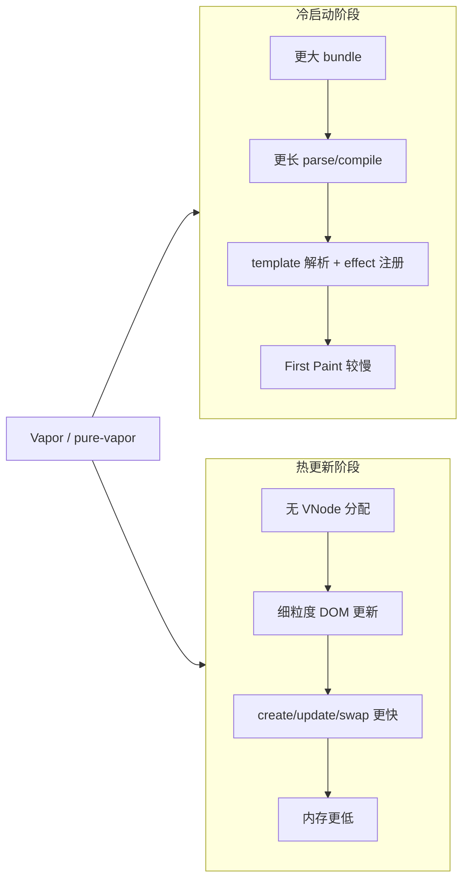

# pure-vapor vs 官方 Vue VNode：js-framework-benchmark 对比分析

在 [js-framework-benchmark](https://github.com/krausest/js-framework-benchmark) 中，将 **官方 Vue VNode 版本** 与 **pure-vapor** 进行性能对比时，常见观测结果如下：

| 维度 | pure-vapor | 官方 VNode |
|------|-----------|-----------|
| 运行时性能（create / update / swap 等） | 领先 | 落后 |
| 内存占用 | 领先 | 落后 |
| 打包体积 | 落后 | 领先 |
| First Paint（首屏绘制） | 落后 | 领先 |

本文解释这一现象的成因，以及它是否符合 Vapor 的设计预期。

---

## 核心结论

Vapor（含 pure-vapor）的设计哲学是：

> **用更多编译期代码 + 专用运行时，换取更少的运行时对象分配和更精准的 DOM 更新。**

js-framework-benchmark 衡量的恰好是两类不同指标：

| 指标类型 | 主要衡量什么 | Vapor 倾向 |
|---------|-------------|-----------|
| 打包体积 / First Paint | JS 下载、解析、冷启动、首次挂载 | 往往落后 |
| create / update / swap 等 | 大量数据变更下的更新效率 | 往往领先 |
| 内存 | 是否维护 VNode 树等中间结构 | 往往领先 |

因此，「冷启动成本」换「热路径性能」是**预期内的架构取舍**，而非异常。

---

## 一、为什么打包体积会更大？

### 1. 代码分布转移：运行时变小，应用代码变大

VDOM 模式把大量逻辑放在**通用运行时**里（patch、diff、VNode 创建），组件编译产物相对紧凑：

```js
_createElementVNode("tr", { key: row.id }, [...])
```

Vapor 则把逻辑**摊到每个组件的编译产物**里。compiler-vapor 对 `v-for` 的典型输出：

```js
const t0 = _template("<tr> ...")  // HTML 字符串
const n0 = _createFor(() => rows, (row) => {
  const n2 = t0()                  // cloneNode
  _renderEffect(() => _setText(...))
  _renderEffect(() => _setClass(...))
  n2.$evtclick = _createInvoker(...)
  return n2
}, row => row.id)
```

benchmark 的 `AppVapor.vue` 模板包含多个按钮、checkbox、事件绑定，以及含 4 个 `<td>`、动态 class、嵌套 ref 文本的 `v-for` 行模板。这些都会直接膨胀最终 bundle：

- 多个 `_template("...长 HTML 字符串...")`
- 每个响应式绑定对应一个 `_renderEffect` 闭包

**运行时省了 VDOM patch，但应用侧代码会膨胀。**

### 2. pure-vapor 运行时并非「零成本」

pure-vapor 是完整 Vapor 运行时，仅依赖 `@vue/shared` 与 `@vue/reactivity`，在 `internal/` 里自实现了 runtime-core 子集。它需要携带：

- `createFor`（含 keyed diff，约 500+ 行）
- `renderEffect`、`block` 插入/移除
- 组件系统、事件委托、`template()` 等

而官方 VNode benchmark 通常使用高度优化的 `vue.runtime.esm-bundler.js`——多年体积优化、tree-shaking 成熟。对**中等复杂度模板**，可能出现：

```
pure-vapor 运行时 + 膨胀的编译产物  >  vue.runtime + 紧凑的 render 函数
```

> CHANGELOG 里说的「Vapor 减小 baseline bundle」主要指：完整 `vue` 包在 Vapor 模式下可去掉整块 VDOM 运行时。与「只用 `vue.runtime` 的 VDOM benchmark」对比，不一定更小。

### 3. 两边都需要的部分一样重

`@vue/reactivity`（`ref`、`shallowRef`、`effect` 等）两边都要打包，体积相当。Vapor 省的是 VNode/patch，不是响应式系统。

---

## 二、为什么 First Paint 会落后？

First Paint 在 js-framework-benchmark 里基本是**冷启动指标**，包含：

1. 下载更多 JS
2. 解析 / 编译（V8 baseline compile）
3. 执行框架初始化
4. 完成首次 DOM 挂载

### 1. 体积更大 → 前两步更慢

这是最直接、通常也是最大的因素。

### 2. Vapor 首次挂载更「重」

`template()` 首次执行要走 `innerHTML` 解析（`packages/pure-vapor/src/vapor/dom/template.js`）：

```js
export function template(html, flags = 0, ns) {
  let node
  return () => {
    if (node) {
      return node.cloneNode(true)  // 后续：cloneNode
    }
    // 首次：innerHTML 解析 HTML 字符串
    t.innerHTML = html
    node = _child(t.content)
    return node.cloneNode(true)
  }
}
```

benchmark 初始 `rows = []` 时：

- **VDOM**：建轻量 VNode 树，`v-for` 几乎是空 fragment，patch 一次即可
- **Vapor**：仍要解析多个 template 字符串、建静态 DOM 壳、为各绑定注册 `renderEffect`、`createFor` 建 watcher 等

即使用户还看不到表格行，**初始化成本已经付出**。

### 3. VDOM 在「空状态首屏」上有结构性优势

VDOM 首屏路径：

```
JS 对象（VNode）→ 一次性 patch → DOM
```

Vapor 路径：

```
解析 template → 直接创建真实 DOM → 注册多个 effect
```

空列表时 VDOM 几乎不创建行相关结构；Vapor 仍要完成整套静态 UI 的 materialize 和 effect 注册。

---

## 三、为什么运行时性能和内存反而领先？

这正是 Vapor 的目标场景，benchmark 的热路径（create 1000/10000 rows、update、swap、remove）正好命中。

### 1. 无 VNode 树 → 内存显著降低

10,000 行时，VDOM 要维护大量 VNode 及 props/children；Vapor 直接持有 DOM Block，没有这层中间表示。

### 2. 更新更细粒度

编译器为每个绑定生成独立 `renderEffect`：

```js
_renderEffect(() => _setText(x2, _toDisplayString(row.label.value)))
```

只更新对应文本节点，不走通用 patch/diff。

### 3. `createFor` 针对 DOM Block 优化

`apiCreateFor.js` 里的 keyed 列表算法直接操作 DOM 节点（`cloneNode`、移动、移除），比「VNode diff → patch → DOM」路径更短。swap rows、partial update 等场景收益明显。

### 4. 与 benchmark 代码风格一致

benchmark 使用 `shallowRef` + `triggerRef`，减少数组级深层响应式追踪；Vapor 在此基础上再省掉 VNode 层，叠加效果更好。

---

## 四、整体取舍示意图



---

## 五、pure-vapor 特有的额外因素

1. **仍处 beta**（当前 `3.6.0-beta.x`），体积优化不如成熟的 `vue.runtime`
2. **独立自实现** runtime-core 子集，未必比官方 `@vue/runtime-vapor` + 分包 tree-shaking 更瘦
3. **导出面较广**（Transition、KeepAlive、Teleport 等），若打包器未充分摇树，会进一步拉大体积差
4. 需确认 benchmark 构建是否误打进 `@vue/compiler-sfc` 等编译期依赖（生产 bundle 不应包含）

---

## 六、如何验证是「架构取舍」还是「配置问题」

可在 js-framework-benchmark 构建产物里对比：

1. **总体积**：`runtime chunk` vs `app chunk` 各占多少
2. **运行时 import 列表**：VDOM 版 vs Vapor 版各引入多少 helper
3. **编译产物**：Vapor 的 `render()` 函数量化对比 VDOM 的 `render`
4. **First Paint 分解**：用 Performance 面板看 parse/compile 与 mount 各占多少

若 `app chunk` 明显更大 + `template()` / `createFor` 初始化占主导，则基本可确认是预期架构行为，而非 bug。

---

## 七、总结

| 场景 | 更适合的选择 |
|------|-------------|
| 高频更新、大列表、长期运行 | pure-vapor / Vapor |
| 首屏体积极小、First Paint 极敏感 | VDOM（`vue.runtime`） |

pure-vapor 在 benchmark 里「热路径赢、冷启动输」是合理且符合设计预期的结果。Vapor 的价值在于**高频更新、大列表、长期运行**的应用；若应用极其看重首屏体积或 First Paint，VDOM 或更激进的编译期静态化方案可能更合适。

---

## 参考

- 内部 benchmark 实现：`packages-private/benchmark/`
- pure-vapor README：`packages/pure-vapor/README.md`
- compiler-vapor 编译产物示例：`packages/compiler-vapor/__tests__/transforms/__snapshots__/vFor.spec.ts.snap`
- Vapor 设计目标：根目录 `CHANGELOG.md`（Vapor Mode 章节）
