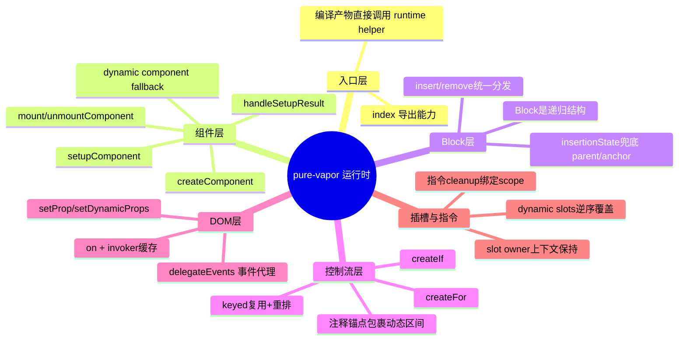

# pure-vapor 执行逻辑图

本文聚焦 `packages/pure-vapor` 运行时在“编译产物调用后”如何创建 Block、挂载 DOM、响应更新与卸载清理。

## 整体执行流程

```mermaid
flowchart TD
  A[编译产物调用 pure-vapor API] --> B{创建什么?}
  B -->|组件| C[createComponent / createDynamicComponent]
  B -->|控制流| D[createIf / createFor / createKeyedFragment]
  B -->|普通节点| E[createElement + setDynamicProps + on/delegate]
  B -->|插槽| F[createSlot / withVaporCtx]
  B -->|指令| G[withVaporDirectives / apply*Model]

  C --> C1[setupComponent]
  C1 --> C2[handleSetupResult 得到 instance.block]
  C2 --> H[insert(block,parent,anchor)]

  D --> D1[建立 start/end 注释锚点]
  D1 --> D2[renderEffect 监听依赖]
  D2 --> D3[remove 旧块 + insert 新块]

  E --> H
  F --> H
  G --> H

  H --> I{block 形态}
  I -->|Node| I1[insertBefore/removeChild]
  I -->|VaporComponentInstance| I2[mountComponent/unmountComponent]
  I -->|Block[]| I3[递归处理子块]

  I2 --> J[生命周期: bm -> mount -> m]
  J --> K[卸载时 scope.stop + um/bum + remove]
```

## 脑图（模块关系）



## 关键路径速记

- 组件路径：`createComponent -> setupComponent -> handleSetupResult -> insert`
- 控制流路径：`createIf/createFor` 在锚点间做块替换
- DOM路径：`setDynamicProps` 负责属性同步，`on/delegateEvents` 负责事件绑定与代理
- 卸载路径：`remove/unmountComponent` 触发生命周期并停止作用域副作用

