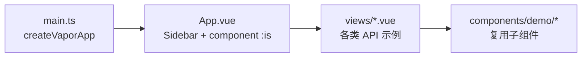

# Vapor API 完整性示例工程计划

## 目标

在 [`test-pure-vapor`](C:\Users\shen\Desktop\test-pure-vapor) 中构建一套 **可交互、可目视验证** 的 Vapor API 示例集，用于测试 `pure-vapor@3.6.0-beta.17` 的运行时与 `compiler-vapor` 的编译能力。移除 [`HelloWorld.vue`](src/components/HelloWorld.vue)，[`App.vue`](src/App.vue) 改为单页示例入口。

## 关键约束（来自 pure-vapor README）

| 支持                                                                                                | 不支持（需标注，不写可运行示例）             |
| --------------------------------------------------------------------------------------------------- | -------------------------------------------- |
| `Transition` / `TransitionGroup` / `KeepAlive` / `Teleport`（Vapor 版）                             | `Suspense`（未导出）                         |
| Composition API + `<script setup vapor>`                                                            | Options API、`getCurrentInstance()` 非 null  |
| 内置指令：`bind, cloak, else-if, else, for, html, if, model, on, once, pre, show, slot, text, memo` | VDOM 互操作（`vaporInteropPlugin` 为空实现） |
| `provide/inject`、生命周期、`defineModel` 等                                                        | SSR / `h()` render function                  |

编译器内置指令列表来源：`@vue/compiler-vapor` 中 `isBuiltInDirective = "bind,cloak,else-if,else,for,html,if,model,on,once,pre,show,slot,text,memo"`。

**不引入 vue-router**：正式版与 PR 预览版均会 import `h` 等 VDOM API，与 pure-vapor 不兼容。改用单页 `<component :is>` 切换示例区块。

## 架构



## 1. 单页应用壳层

**不新增路由依赖**，所有示例在同一页面内通过侧边栏切换。

**区块配置**（[`src/App.vue`](src/App.vue) 内 `sections` 数组）：

| 区块 ID       | 组件            | 覆盖 API                                                                                                                                                                                                                                 |
| ------------- | --------------- | ---------------------------------------------------------------------------------------------------------------------------------------------------------------------------------------------------------------------------------------- |
| `overview`    | OverviewView    | 能力矩阵、版本信息、通过/不支持清单                                                                                                                                                                                                      |
| `rendering`   | RenderingView   | `{{ }}`、`v-text`、`v-html`、多根节点、`:is` 动态组件、`v-once`、`v-memo`、`useTemplateRef`                                                                                                                                              |
| `directives`  | DirectivesView  | `v-if/else-if/else`、`v-show`、`v-for`（数组/对象/template/与 v-if 同元素）、`v-model`（text/number/checkbox/radio/select/multiple/组件双向绑定）、`v-on` 修饰符（`.prevent/.stop/.once/.self/.capture`、按键修饰符）、自定义 Vapor 指令 |
| `style`       | StyleView       | `:class`（静态/对象/数组）、`:style`、scoped CSS、`:deep()`、`v-bind()` CSS 变量（`useCssVars`）、`useCssModule`                                                                                                                         |
| `component`   | ComponentView   | `defineProps` + `withDefaults`、`defineEmits`、`defineExpose`、`defineSlots`（默认/具名/作用域）、`defineModel`、`attrs` 透传、`:is` 异步组件（`defineAsyncComponent`）                                                                  |
| `builtin`     | BuiltinView     | `<Transition>`、`<TransitionGroup>`、`<KeepAlive>` + `onActivated/onDeactivated`、`<Teleport>`                                                                                                                                           |
| `composition` | CompositionView | `ref/reactive/computed/readonly/shallow*`、`watch/watchEffect`、`provide/inject`、`useAttrs/useSlots/useModel/useId`                                                                                                                     |
| `lifecycle`   | LifecycleView   | `onBeforeMount/onMounted/onBeforeUpdate/onUpdated/onBeforeUnmount/onUnmounted/onErrorCaptured`，配合 EventLog 面板实时输出                                                                                                               |
| `limitations` | LimitationsView | 只读说明：`Suspense`、`Options API`、`getCurrentInstance()`、`@vue:xxx` 元素生命周期                                                                                                                                                     |

**入口改造**：

- [`src/main.ts`](src/main.ts)：`createVaporApp(App).mount('#app')`
- [`src/App.vue`](src/App.vue)：左侧按钮导航 + 右侧 `<component :is="activeComponent()" />`
- 所有示例组件使用 `<script setup lang="ts" vapor>`

## 2. 共享 UI 与辅助组件

新建 [`src/styles/demo.css`](src/styles/demo.css)（示例专用样式，保留现有 [`src/style.css`](src/style.css) 作为全局基础）。

| 组件                                                                   | 职责                                                                                       |
| ---------------------------------------------------------------------- | ------------------------------------------------------------------------------------------ |
| [`src/components/demo/DemoCard.vue`](src/components/demo/DemoCard.vue) | 统一卡片：标题、API 标签、说明、演示区                                                     |
| [`src/components/demo/EventLog.vue`](src/components/demo/EventLog.vue) | 生命周期/事件日志面板                                                                      |
| [`src/components/demo/Child*.vue`](src/components/demo/)               | 子组件：Props 接收、Emit 触发、Slot 传递、Model 绑定等（每个示例独立小文件，便于隔离测试） |

每个示例遵循 **「说明 + 交互控件 + 可视结果 + 状态输出」** 四段式，方便手动回归。

## 3. 各类示例要点（实现细节）

### RenderingView

- 动态组件：`:is="currentComp"` 切换两个 vapor 子组件
- `v-memo`：大列表切换依赖项，观察 DOM 复用
- `v-once`：计数器变化后静态区块不更新
- Template ref：按钮聚焦输入框

### DirectivesView

- `v-for` + `v-if` 同元素（beta.17 已修复）
- `v-model` 组件：子组件 `defineModel()` + 父组件 `v-model` / `v-model:count`
- 自定义指令（Vapor 接口）：

```ts
// 注册示例：watchEffect + cleanup
const vHighlight = (el: HTMLElement, source?: () => unknown) => {
  watchEffect(() => {
    el.style.background = source?.() ? "#fef08a" : "";
  });
};
```

### StyleView

- scoped + `:deep(.child)` 验证样式穿透
- `<style>` 中使用 `v-bind(themeColor)` 绑定 CSS 变量

### BuiltinView

- Transition：`enter/leave` 类名 + toggle 按钮
- TransitionGroup：列表增删带动画
- KeepAlive：两个 tab 子组件切换，EventLog 显示 activated/deactivated
- Teleport：`to="body"` 渲染 modal

### LifecycleView

- 单一组件内挂载所有 hook，配合 `ref` 触发 update/unmount

### LimitationsView

- 静态文档页，列出不支持 API 及原因（引用 pure-vapor README 排除表）
- **不**尝试运行 Suspense（编译会通过但运行时报 import 错误）

## 4. 清理与收尾

- 删除 [`src/components/HelloWorld.vue`](src/components/HelloWorld.vue) 及 [`src/assets/hero.png`](src/assets/hero.png) 缺失引用
- 运行 `vp check` + `vp build` 验证编译

## 文件变更清单

**修改**：`package.json`、`src/main.ts`、`src/App.vue`、`src/style.css`（引入 demo.css）

**新增**：

- `src/views/` × 9
- `src/components/demo/` × ~15（子组件按需）
- `src/styles/demo.css`

**删除**：`src/components/HelloWorld.vue`

## 风险与应对

| 风险                              | 应对                                                          |
| --------------------------------- | ------------------------------------------------------------- |
| 某 API 在 pure-vapor 有 edge case | DemoCard 加「预期行为」说明，便于对照 issue                   |
| 页面文件较多                      | 每个 View 自包含 demo 逻辑，复杂子场景拆到 `components/demo/` |
| 单页切换 vs 路由                  | 用 `ref` + `<component :is>` 切换，无需 URL 同步              |
